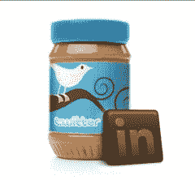
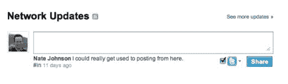
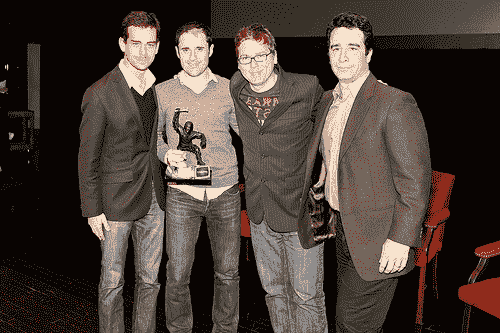

# 随着 LinkedIn 也疯狂发推，社交网络继续围绕 Twitter 展开

> 原文：<https://web.archive.org/web/https://techcrunch.com/2009/11/09/social-networks-continue-to-rally-around-twitter-as-linkedin-goes-tweet-crazy-too/>

# 随着 LinkedIn 也疯狂发推，社交网络继续围绕着 Twitter

职业社交网络 [LinkedIn](https://web.archive.org/web/20230127031519/http://www.linkedin.com/) 早就有一个[功能](https://web.archive.org/web/20230127031519/http://blog.linkedin.com/2008/02/28/the-new-look-of/)，让用户更新他们在个人资料上的状态。但显而易见的是，LinkedIn 用户使用状态功能进行大众传播的频率远不及他们使用 Twitter 或脸书进行同样目的的频率。事实上，我对 LinkedIn 用户进行了抽样调查，他们热衷于使用该网站进行社交，但从不更新个人资料上的状态。许多人甚至不知道 LinkedIn 有状态更新功能。从今晚开始，LinkedIn 将[与 Twitter 整合](https://web.archive.org/web/20230127031519/http://blog.linkedin.com/2009/11/06/allen-blue-twitter-and-linkedin-like-peanut-butter-and-chocolate)，让用户同步他们的 LinkedIn 和 Twitter 账户，以便在 Twitter 上实时广播 LinkedIn 的状态更新，反之亦然。那么这是如何工作的呢？

LinkedIn 现在允许你更新你在 LinkedIn 个人资料上的状态，然后自动将消息分享到 Twitter。要启用交叉发布功能，您只需点击主页上您的网络更新框下的新 Twitter 框，并与您的 Twitter 帐户同步(通过 oAuth)。

集成也以另一种方式工作。您还可以通过添加标签“#in”或“li”，从 Twitter 或任何其他客户端将推文分享到您的 LinkedIn 个人资料。作为 LInkedIn 设置过程的一部分，你可以选择将你所有的推文或者选择带有标签“in”的推文从 Twitter 发送回 LinkedIn 作为状态更新。你现在也可以将你的 Twitter 流导入到你的个人资料中，这也是一个可选功能。因此，你的个人资料将显示“最近的推文”部分，其中将包括你的推文的实时流。在你的 LinkedIn 个人资料中显示你的 Twitter 流的能力无疑为你的职业简历提供了一个令人信服的社交媒体背景。正如 Twitter 联合创始人[比兹·斯通](https://web.archive.org/web/20230127031519/http://www.crunchbase.com/person/biz-stone)在关于和谐整合的[视频](https://web.archive.org/web/20230127031519/http://www.youtube.com/watch?v=QVZ7VA4zORE)中所说，“Twitter 的商业用例变得非常重要。”他补充道，“他们在网上为自己创造的形象是他们简历的一部分。”斯通还说，LinkedIn 和 Twitter 就像“花生酱和巧克力”一样是免费的(因此有了这个标志)。

考虑到 LinkedIn 自己的状态更新功能并不是非常受欢迎，LinkedIn 与 Twitter 整合是有意义的。直接在你的 LinkedIn 个人资料上发推文的能力将为该网站增加大量新鲜内容，或许还会为社交目的和职业兴趣带来新的流量。或许 Twitter 的整合将为 LinkedIn 的状态更新功能注入新的活力。 [AIM](https://web.archive.org/web/20230127031519/http://techcrunch.com/2009/09/07/aim-now-goes-both-ways-with-twitter-and-facebook/) 和 [MySpace](https://web.archive.org/web/20230127031519/http://techcrunch.com/2009/09/21/myspace-hooks-up-with-twitter-offers-two-way-sync/) 也做出了类似的举动，增加了与 Twitter 的双向同步。正如我的同事埃里克·舍恩菲尔德(Erick Schonfeld)最近雄辩地写道的那样，LinkedIn 和其他社交媒体网站和网络一样，正在意识到顺应潮流比逆水行舟更好。

这份声明中的异类似乎是脸书，他还没有在面向所有用户的功能中添加 [Twitter 聚合](https://web.archive.org/web/20230127031519/http://techcrunch.com/2009/08/20/facebook-syndicates-updates-from-pages-to-twitter-still-holds-user-updates-hostage/)。LinkedIn 与脸书同步也是有意义的，但 LinkedIn 的联合创始人兼产品战略副总裁艾伦·布鲁(Allen Blue)表示，这是该网站“未来可能会考虑的事情”

Blue 表示，目前，LinkedIn 正集中精力在 Twitter 上，因为微博平台上正在进行“大量的商业对话”。但是 LinkedIn 的另一位创始人兼执行主席[雷德·霍夫曼](https://web.archive.org/web/20230127031519/http://www.crunchbase.com/person/reid-hoffman)最近[加入了](https://web.archive.org/web/20230127031519/http://techcrunch.com/2009/11/02/an-angel-goes-pro-reid-hoffman-now-officially-a-venture-capitalist-at-greylock/)风险投资公司 [Greylock](https://web.archive.org/web/20230127031519/http://www.crunchbase.com/financial-organization/greylock) 成为合伙人，他是脸书的天使投资人，所以 LinkedIn 未来与脸书友好相处是有道理的。

当被问及在 LinkedIn 的状态更新功能中添加网址缩写的可能性时(考虑到与 Twitter 的集成，这将非常有用)，LinkedIn 发言人 Kay Luo 表示，这将非常有意义，并且可能是未来的一个可能添加项。罗拒绝透露 LinkedIn 是否会创建自己的网址缩写程序，或者与其他数十亿网址缩写程序整合。

LinkedIn 无疑在增长，几周前已经达到了 5 千万用户，像这样的创新功能只会增加社交网络的受欢迎程度。随着 Twitter 继续走向全球，这将补充 LinkedIn 相当大的国际影响力。

值得注意的是，Twitter 功能将在未来 24 小时内逐步向所有 LinkedIn 用户推出。

