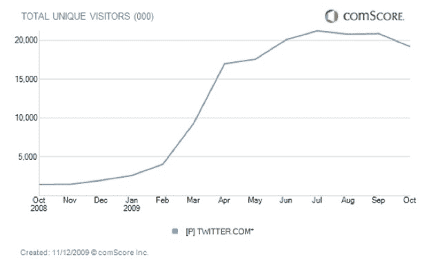

# Twitter 遇到麻烦:10 月份美国访客下降 8% TechCrunch

> 原文：<https://web.archive.org/web/https://techcrunch.com/2009/11/12/trouble-at-twitter-u-s-visitors-down-8-percent-in-october/>

# 推特上的麻烦:10 月份美国游客下降了 8%

自去年夏天以来，Twitter 在美国的增长一直停滞在 T2。但在 10 月，从美国到 Twitter.com 旅游的人数实际上首次出现环比下降，降幅为 8%。comScore 今天发布的估计显示，Twitter 的国内独立访客人数为 1920 万，低于 9 月份的 2090 万。

以年度为基础，Twitter 仍然保持着巨大的增长，从 2008 年 10 月的 140 万访问者增长了 1271%。在全球范围内，9 月份 T4 的游客数量似乎仍在稳步增长，达到了 5840 万人次。但是像 Twitter 这样高速增长的公司不能在本土市场减速。

首席执行官伊万·威廉姆斯最近[承认美国经济放缓](https://web.archive.org/web/20230204210432/https://techcrunch.com/2009/10/20/web-2-0-summit-a-conversation-with-twitters-ev-williams/)，并希望一系列新功能将有助于重振该网站的增长。其中许多功能已经推出，包括新的[转发按钮](https://web.archive.org/web/20230204210432/https://techcrunch.com/2009/11/10/hate-it-or-love-it-twitters-new-retweet-style-rolling-out/)、[列表](https://web.archive.org/web/20230204210432/https://techcrunch.com/2009/10/15/breaking-twitter-begins-lists-rollout/)和[地理定位](https://web.archive.org/web/20230204210432/https://techcrunch.com/2009/08/20/twitter-can-now-know-where-you-tweet/)功能。

Twitter 显然致力于[在自己的网站上提供更好的服务](https://web.archive.org/web/20230204210432/https://techcrunch.com/2009/11/11/simple-is-as-simple-does-the-risk-of-retweet/)(这些数字没有衡量移动或桌面客户端的使用情况，这很容易占到 Twitter 所有使用情况的一半)。但是当它在拨弄的时候，它的竞争对手脸书继续前进，越走越远。

这些新功能足以让美国经济恢复增长吗？如果他们不这样做，Twitter 的麻烦将真正开始。