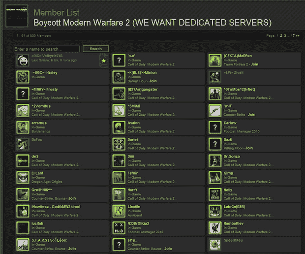

# 抵制 PC 版《现代战争 2》到此为止

> 原文：<https://web.archive.org/web/https://techcrunch.com/2009/11/13/so-much-for-that-pc-version-modern-warfare-2-boycott/?guccounter=1&guce_referrer=aHR0cHM6Ly93d3cuZ29vZ2xlLmNvbS8&guce_referrer_sig=AQAAAL6K91-BCnBMoMmnP_XRePFOyb8Octt8Zc8I0kWsBf-M36yBuElTU9fc6AZqEaMtxqJQNEmxXg92IaW2yISD4RYiSGyYiDxTB3BYIE1yoHC7xfu1-tOEFMr7f-K_MUNWiNgBitgoZ4cJNRF_OJB6muUziiV2RZ0W5qub0bVVNxx3>

# 抵制 PC 版现代战争 2 到此为止

谢谢， [PC 游戏玩家](https://web.archive.org/web/20230326234621/http://www.computerandvideogames.com/forums/viewtopic.php?p=1573356#1573356)

那个 [*现代战争 2* 抵制](https://web.archive.org/web/20230326234621/http://www.crunchgear.com/2009/11/06/hasnt-infinity-ward-earned-your-trust-on-modern-warfare-2/)怎么样了？嗯，从这张截图[来看，似乎你们中的许多人要么是在虚张声势，要么就是无法抗拒诱惑，就像](https://web.archive.org/web/20230326234621/http://www.rockpapershotgun.com/2009/11/12/why-they-dont-take-boycotts-seriously/)[石头剪刀布前几天所说的那样](https://web.archive.org/web/20230326234621/http://www.rockpapershotgun.com/2009/11/11/20975/)，把光标放在那个人的脸上。抵制只有在你坚持你的威胁时才会起作用…