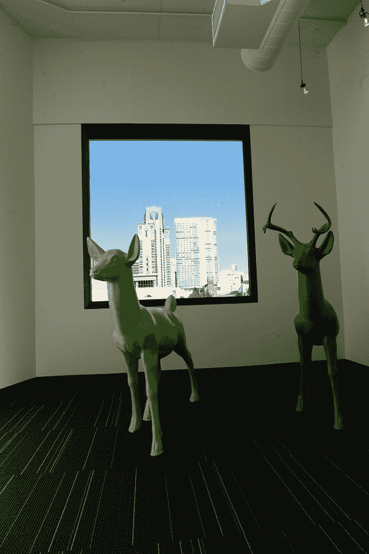
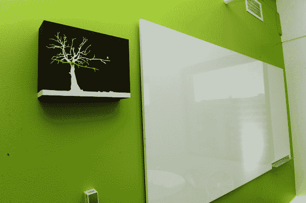

# 员工展示的 Twitter 新总部(图片)

> 原文：<https://web.archive.org/web/https://techcrunch.com/2009/11/16/twitters-new-headquarters-as-shown-off-by-employees-pictures/>

# 员工展示的 Twitter 新总部(图片)

今天，Twitter 搬进了位于旧金山的一个新的、更大的办公室。这个空间，以前是 Bebo 的科幻办公室，就在他们旧办公室的拐角处。

Twitter 团队的一些成员在周末花了很多时间用一些 Twitter 主题的元素装饰新住所，比如鸟和@符号。看看下面 Twitter 员工发布到网上的一些图片。是的，这里有一个 DJ 台，显然还有厕所隔间里的化妆镜。

【T2

[图片:flickr/ [瑞恩斯金](https://web.archive.org/web/20230219001150/http://www.flickr.com/photos/ryansking/sets/72157622816428160/)，twitpic/ [卡洛琳](https://web.archive.org/web/20230219001150/http://twitpic.com/photos/caroline)，yfrog/ [罗比](https://web.archive.org/web/20230219001150/http://img697.yfrog.com/i/s1n.jpg/)，twitpic/ [wfarner](https://web.archive.org/web/20230219001150/http://twitpic.com/pryjq) ，twitpic/ [jennadawn](https://web.archive.org/web/20230219001150/http://twitpic.com/ps3hu)

**更新**:还有一堆来自 [@twitter Flickr 账号](https://web.archive.org/web/20230219001150/http://www.flickr.com/photos/twitteroffice/sets/72157622693903079)的图片:

