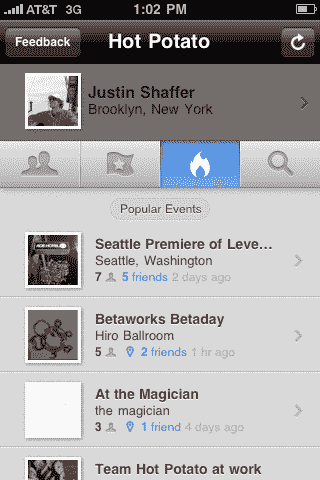
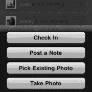

# 烫手山芋围绕现在真正发生的事情组织信息流 TechCrunch

> 原文：<https://web.archive.org/web/https://techcrunch.com/2009/11/20/hot-potato-launch/>

# 烫手山芋围绕现在真正发生的事情组织信息流

昨天，推特[将组织问题](https://web.archive.org/web/20221006195928/http://www.beta.techcrunch.com/2009/11/19/twitter-now-asks-whats-happening/)从“你在做什么？”到“发生了什么？”但是如果你想知道现在到底发生了什么，看看[烫手山芋](https://web.archive.org/web/20221006195928/http://www.hotpotato.com/)，一家正在我们的[实时计算](https://web.archive.org/web/20221006195928/http://www.beta.techcrunch.com/real-time-crunchup-sf/)上发布的初创公司。Hot Potato 发布了一款 iPhone 应用程序，它可以让你根据你的位置和你的朋友在做什么来创建一系列关于事件的对话。

Hot Potato 是一款根据事件组织对话流的微消息应用。对于烫手山芋来说，事件可以是任何正在发生的事情:一场篮球赛、一场音乐会、一次聚会、一次街头集市、买一辆新车，甚至是两个朋友一起骑车。事件是人们想要分享的任何正在发生的事情。

该应用程序使用 iPhone 中的 GPS 向您显示人们在您附近谈论的事件。如果你在音乐会上，你可以看到其他人(他们也有这个应用程序)对它的看法。你可以像使用 Foursquare 一样“签到”,但你也可以张贴一张便条或照片。关于某一特定事件的所有笔记和照片都被收集在同一个网页上，这个网页也可以在网上找到。

Hot Potato 使用事件作为其主要过滤器，并在顶部添加了社交和地理层。您可以使用您的脸书帐户登录，这样您就可以轻松地与现有的朋友联系。您也可以添加您的 Twitter 帐户。当你发出一条短信或上传一张照片时，它可以被分享到脸书上，发布到推特上，或通过电子邮件分享，并带有返回原始内容的链接。链接回到一个烫手山芋网站，所有的链接都托管在那里。或者你可以简单地分享你的烫手山芋状态(出席、观看、关注)。

所以你可以谈论一些正在发生在你身上的事情，分享一些图片，并把它传递下去。其他烫手山芋用户可以插话，你可以看到你周围正在发生什么。Hot Potato 是定位应用程序的又一个例子，它将社交网络与现实世界结合在一起。你在参加一个活动。您关注的某个人也在同一事件中。你们通过烫手山芋找到了彼此。或者谁知道呢，也许你遇到了新的人——因为你们同时在同一个地方谈论着这个烫手山芋。

【T2

