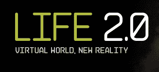

# 第二人生在 Sundance TechCrunch 获得 2.0 版生活

> 原文：<https://web.archive.org/web/https://techcrunch.com/2009/12/03/second-life-2-0-sundance/>

# “第二人生”在圣丹斯获得了 2.0 版的生活

还有人去第二人生吗？这些天，它看起来像是一座鬼城，尽管你不时会听到原始虚拟世界悄然回归的传言。好吧，至少第二人生将会在电影院获得第二人生。一部名为 *[生活 2.0](https://web.archive.org/web/20230122121053/http://www.life2movie.com/)* 的纪录片将在圣丹斯电影节上映。

《生活 2.0》由掌星娱乐公司(theglobe.com 联合创始人斯蒂芬·帕特诺的独立电影公司)和安德鲁·劳伦制作公司制作。以下是他们在新闻稿中对这一举措的描述:

> 这部长篇纪录片讲述了一群人的生活被虚拟世界“第二人生”戏剧性地改变。这部电影不仅仅是对热门新技术的审查，更是一部亲密的、基于角色的戏剧，讲述了人们在虚拟世界中寻找他们在现实生活中缺失的东西。

没错。

如果这部电影能够唤醒“第二人生”的剩余居民，让他们离开电脑，和其他真实的人一起去电影院，我就认为它是成功的。虽然，我不确定第二人生的人能填满多少真正的电影院。

下面是一个预告，告诉你这部电影的一切:

[http://vimeo.com/moogaloop.swf?clip_id=7969062&server = vimeo . com&show _ title = 1&show _ byline = 1&show _ portrait = 0&color =&full screen = 1](https://web.archive.org/web/20230122121053/http://vimeo.com/moogaloop.swf?clip_id=7969062&server=vimeo.com&show_title=1&show_byline=1&show_portrait=0&color=&fullscreen=1)

[《生活 2.0》纪录片预告](https://web.archive.org/web/20230122121053/http://vimeo.com/7969062)来自 [Jason Spingarn-Koff](https://web.archive.org/web/20230122121053/http://vimeo.com/user2738813) 于 [Vimeo](https://web.archive.org/web/20230122121053/http://vimeo.com/) 播出。