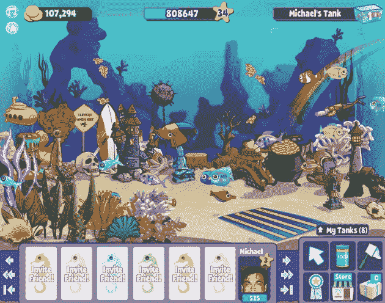
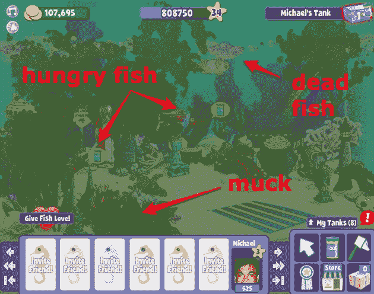
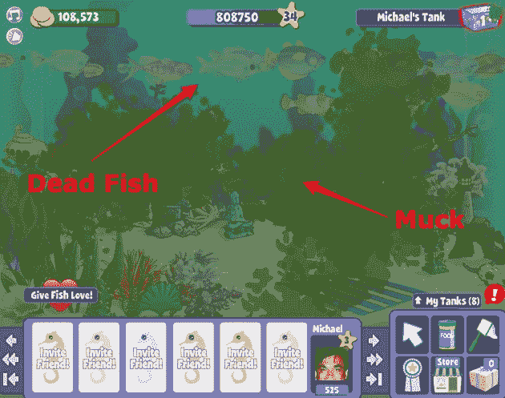

# 嗨，我叫迈克，我是一名菲什维尔瘾君子

> 原文：<https://web.archive.org/web/https://techcrunch.com/2009/12/04/hi-my-name-is-mike-and-im-a-fishville-addict/>

有传言称，女演员莎尔玛·海雅克在拍摄电影《T2》之前从未吸烟。但是她必须学会如何扮演艺术家弗里达·卡罗，在电影之后她很难退出。

我很清楚她的感受。因为我上个月写的所有关于 T4 的帖子的部分后果是对 Zynga 的游戏之一 Fishville 的挥之不去的沉迷(是的，是脸书因为违反广告规则而关闭了三天的 T5 游戏)。

那些斯卡维尔帖子中的很多信息都来自于传统的研究。我玩游戏是为了看看会发生什么。起初我认为它们很荒谬。我在法姆维尔种植仙人掌树和挤牛奶，在吸血鬼战争中杀死不死生物，在黑帮战争中用撬棍袭击黑手党老大。当然，我点击了报价，甚至付了几次现金。

当然，这都是生意。直到我注意到我要回到 FishVille，甚至在这个系列完成之后。我有 8 个坦克去和数百条鱼正在成长从鸡蛋到成人。那些鸡蛋被卖了，我买了更多的鸡蛋，循环继续。没过多久，我就达到了 34 级——如此之高，以至于在那里我可以买到各种各样的鱼。我已经积累了 808，647 个经验点。我为我的坦克的原始状态和丰富的装饰品感到自豪。请注意一群快乐、营养丰富的鱼:

这些游戏的一个重要部分是每天多次回到游戏中的冲动。喂鱼。或者收割玉米。等待太久，鱼会死，玉米会枯萎，你会失去货币和经验值。我要确保定期回来检查我的鱼，这样它们就不会死了。实际上，我一度对自己说:“哇，当我去度假时，我需要提前计划，这样鱼就不会饿死了。”

在某个时候，我在办公室里谈论 FishVille，几个人问我为什么在帖子完成后还在玩这个游戏。我意识到，然后，在一瞬间，我有一个问题。我沉迷于 FishVille。总计。失败者。

那天我辞职了。冷火鸡。几天后，我回来查看我手头的情况。太难看了。大多数鱼都死了，少数活着的鱼在挨饿，水族馆又脏又乱。我截图了一下，赶紧出去了。

今天早上我最后一次查看了我在菲什维尔的情况。所有的鱼现在都死了。坦克一塌糊涂。

在你嘲笑我之前(或者在你笑完之后)，认识到这一点:仅在脸书，每月就有 7000 万人玩 FarmVille(上个月是 6000 万)。有脸书[组织](https://web.archive.org/web/20221210085409/http://www.facebook.com/pages/FAA-Farmville-Addicts-Anonymous/128092928880)对 FarmVille 上瘾。这里有一些来自前瘾君子的关于如何避免上瘾的[建议](https://web.archive.org/web/20221210085409/http://www.nyutech.com/2009/09/how-to-get-rid-of-farmville-addiction.html)。YouTube 上到处都是承认自己沉迷于这些游戏的人。

社交游戏成瘾是一个真正的问题。这可能是一个有点滑稽的问题，但它仍然是一个问题。难怪没有信用卡的孩子会接受所有这些粗略的提议来获得游戏币。他们上钩了。