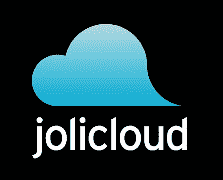
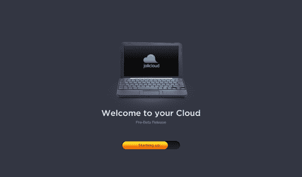

# Jolicloud 在 Le Web TechCrunch 发布上网本操作系统测试版

> 原文：<https://web.archive.org/web/https://techcrunch.com/2009/12/10/jolicloud-beta-le-web/?utm_source=feedburner&utm_medium=feed&utm_campaign=Feed:+Techcrunch+(TechCrunch>&utm_content=Google+Reader)

# Jolicloud 在 Le Web 发布其上网本操作系统的测试版

知名欧洲企业家[塔里克·克里姆](https://web.archive.org/web/20221208235056/http://www.crunchbase.com/person/tariq-krim)刚刚在 Le Web 上展示了 [Jolicloud](https://web.archive.org/web/20221208235056/http://www.jolicloud.com/) 的公开测试版，这是一种新型的[上网本操作系统](https://web.archive.org/web/20221208235056/http://www.beta.techcrunch.com/2009/06/01/netbook-os-jolicloud-prepares-for-launch-exclusive-screenshots-to-whet-your-appetite/)，我们之前已经报道过几次。

到今天为止，你可以通过简单地下载安装文件并从机器上运行，在大多数 Windows 上网本上轻松地安装 Jolicloud Express(当我安装 alpha 版本时，我仍然需要将它下载到 USB key 并从那里启动)。

它将保持 Windows 分区和数据的安全，所以如果你愿意，你可以随时切换回 Windows。

Jolicloud 还在 Mozilla 工程师和开发人员的帮助下，为系统添加了 HTML5 启动器。主要目标是给人们一种方法，让他们可以用 Jolicloud 帐户同步任意数量的上网本，包括偏好设置、已安装的应用程序等等。

尝试一下，让我们知道你的想法。

去年 7 月，Jolicloud 从 Atomico Ventures 和 Mangrove Capital Partners 获得了 420 万美元的首轮融资。

