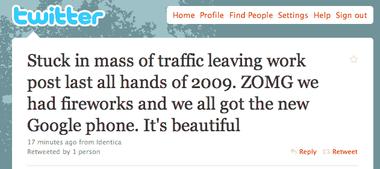
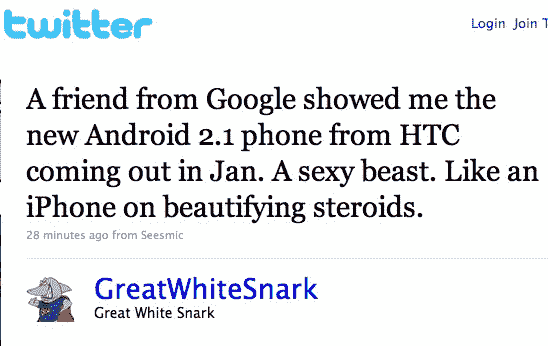
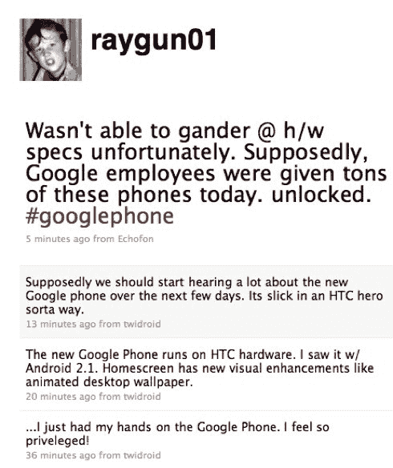

# ZOMG 谷歌手机“就像打了美容类固醇的 iPhone”

> 原文：<https://web.archive.org/web/https://techcrunch.com/2009/12/11/google-phone-zomg/>

# ZOMG 谷歌手机“就像服用了美容类固醇的 iPhone”

 [我们告诉你谷歌手机已经确认](https://web.archive.org/web/20221207200458/http://www.beta.techcrunch.com/2009/11/17/thegoogle-phone/)。现在一些谷歌人似乎也证实了这一点。Twitter 上有很多关于谷歌员工使用 HTC 制造的运行 Android 2.1 的解锁谷歌手机的聊天。这些设备预计将于明年 1 月问世。

我们注意到一条来自谷歌项目经理的推特消息，他[写道](https://web.archive.org/web/20221207200458/http://twitter.com/lhawthorn/status/6586495573)*“2009 年最后一个月，离开工作岗位的交通堵塞。ZOMG:我们放了焰火，我们都得到了新的谷歌手机。太美了。”*

另一个叫[杰森·豪厄尔](https://web.archive.org/web/20221207200458/http://twitter.com/raygun01)的家伙说他接触过这款设备，他说这是 HTC 制造的，运行的是 Android 2.1: *“新的谷歌手机运行在 HTC 硬件上。我看到的是 w/ Android 2.1。主屏有新的视觉增强，如动画桌面壁纸。”*

*“据说，谷歌员工今天收到了大量这样的手机。”他补充道。*

还有一个[最后一个](https://web.archive.org/web/20221207200458/http://twitter.com/GreatWhiteSnark/status/6592977842)::*一个谷歌的朋友给我看了 HTC 一月份发布的新的 Android 2.1 手机。一个性感的野兽。就像打了美容类固醇的 iPhone。”*

在我们看来，谷歌今天可能已经向员工分发了许多新的谷歌手机设备，他们自然会向朋友展示这些设备。

