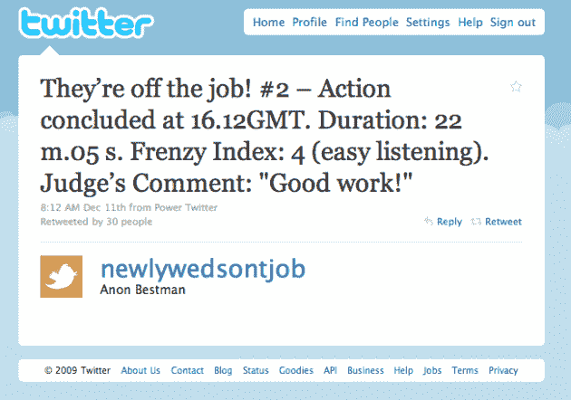

# 伴郎操纵新婚夫妇的床在做爱时发微博。不是开玩笑。TechCrunch

> 原文：<https://web.archive.org/web/https://techcrunch.com/2009/12/12/newlywed-sex-tweets/>

# 伴郎操纵新婚夫妇的床在做爱时发微博。不是开玩笑。

当英国一名男子在朋友的婚礼上被要求做伴郎时，他被感动了。如此感动，以至于他承诺在婚礼前或婚礼期间不搞任何恶作剧。不过婚礼之后，那就是另一个故事了。

这名选择匿名的男子建立了[这个推特账户](https://web.archive.org/web/20221208043428/http://twitter.com/newlywedsontjob)，唯一的目的是当新婚夫妇做爱时自动发推特。我没开玩笑。如果你想要完整的故事，从下往上阅读整个推文流。但基本上，这个人在他们去度蜜月的时候监视他朋友的房子，他在他们的床垫下放了一个装置。这个装置，类似于在这里发现的[，是一个压敏垫，当性活动开始时，当性活动结束时，它会发出“行动”的力度和“疯狂”的评级。](https://web.archive.org/web/20221208043428/http://www.instructables.com/id/The-Twittering-Office-Chair/)

12 月 9 日见证了第一次这样的行动。这是[的第一份报告](https://web.archive.org/web/20221208043428/http://twitter.com/newlywedsontjob/status/6494704432):

> 他们在工作！# 1–行动于格林威治时间 12.21 开始。重量:84 公斤。

然后结束了——3 分钟后:

> 他们下班了！# 1–动作以 12.24GMT 结束。持续时间:3 分 15 秒。疯狂指数:8(恐怖)。法官点评:“就这样？”

但是，唉，那只是一个在床上跳的家伙的测试，以确保它能工作。确实如此。所以真正的第一个动作是[跟随](https://web.archive.org/web/20221208043428/http://twitter.com/newlywedsontjob/status/6570066280):

> 他们在工作！# 2–行动于格林威治时间 15:50 开始。重量:151 公斤。

22 分钟[后](https://web.archive.org/web/20221208043428/http://twitter.com/newlywedsontjob/status/6570717305):

> 他们下班了！# 2–动作在 16.12GMT 结束。持续时间:22 分 05 秒。疯狂指数:4(容易听到)。评委点评:“干得好！”

在每个人都为此疯狂之前，请记住所有这些都是匿名进行的。朋友和这对夫妇都不知道。事实上，谁知道这是不是真的，谁在乎呢，这太好笑了。尽管如此，这个人声称他很快就会让他的朋友参加进来。*你永远不会知道他们是谁。或者我是谁。我想我会在适当的时候告诉我的伴侣，他已经有观众了。所以传播消息吧！，*[写道](https://web.archive.org/web/20221208043428/http://twitter.com/newlywedsontjob/status/6478284828)无名氏。想想它的传播。

那他为什么要这么做？“*顺便说一下——当他是我的伴郎时，他给我缝合了一些腐烂的东西，所以我认为这是合理的报复:(*，”他[推特](https://web.archive.org/web/20221208043428/http://twitter.com/newlywedsontjob/status/6478303711)。

哦，推特，快乐永无止境。他们接下来会想到什么？

*【照片:推特/* [*微博*](https://web.archive.org/web/20221208043428/http://www.flickr.com/photos/pnoeric/2970557592/)