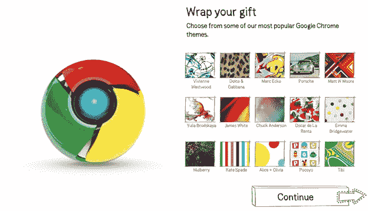

# 谷歌希望你在圣诞节送铬合金

> 原文：<https://web.archive.org/web/https://techcrunch.com/2009/12/14/google-chrome-christmas/>

# 谷歌希望你在圣诞节送铬合金

不知道假期能得到什么礼物？赠送一个免费的浏览器怎么样？你的朋友和亲戚不会认为你太小气，不会给他们买真正的礼物。如果礼物是用虚拟包装纸包起来的谷歌闪亮的新 Chrome 浏览器，他们甚至会感谢你。

在假日促销活动中，谷歌允许您赠送[Chris stmas](https://web.archive.org/web/20221006101736/http://www.chromeforchristmas.com/)。这是一个非常简单但有效的营销网站。你选择一些主题纸，包在谷歌浏览器的标志上，然后通过电子邮件发送给收到“礼物”的人，同时附上一张附有你照片甚至视频的电子卡。他们打开虚拟礼物，并被提示下载 Chrome。

谷歌现在开始大力推广 Chrome，不仅在美国，在国外的 T4 也是如此。Chrome beta 版现在已经在 Macs 上上市并且提供了越来越多的[扩展](https://web.archive.org/web/20221006101736/http://www.beta.techcrunch.com/2009/12/10/chrome-firefox/)。还有更糟糕的礼物你可以送。

(给[保罗·福斯特](https://web.archive.org/web/20221006101736/http://www.paulfosterdesign.co.uk/default.htm)的提示)