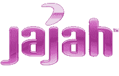

# 已确认:Jajah 以 2.07 亿美元的价格售出 TechCrunch

> 原文：<https://web.archive.org/web/https://techcrunch.com/2009/12/23/confirmed-jajah-sold-207-million/>

# 证实:Jajah 以 2.07 亿美元售出

几天前的[报道称](https://web.archive.org/web/20221007022929/http://www.beta.techcrunch.com/2009/12/20/o2-buys-jajah/) [Jajah](https://web.archive.org/web/20221007022929/http://jajah.com/) 与 O2 的交易以 2 亿美元成交是正确的。Telefónica Europe(又名 O2)刚刚宣布以 1.45 亿欧元(2.07 亿美元)的全现金交易收购 Jajah。

Jajah 提供互联网通话服务，因此与 Skype 形成竞争，至少从 11 月份(TechCrunch 最先对此进行报道)开始，jajah 就在谷歌收购小得多的 Gizmo5 之后被搁置。

Jajah 拥有 1500 万用户，并提供了超过 10 亿次 VoIP 通话。

Jajah 将继续以自己的品牌运营。然而，对于所有参与其中的人来说，这次交易并不愉快。这笔交易主要是由 Jajah 的投资者推动的，特别是红杉。我们听说首席技术官阿米查·柳文欢已经离开了公司，因为他和他在以色列的工程团队没有得到与美国同行相同的待遇。在这种类型的交易中，并不是每个人都最终获胜。Jajah 并不是红杉投资组合中的下一个 10 亿美元公司。

鉴于它总共筹集了 3300 万美元的资金，2 亿美元的退出是一个不错的结果。