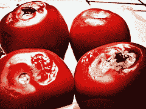
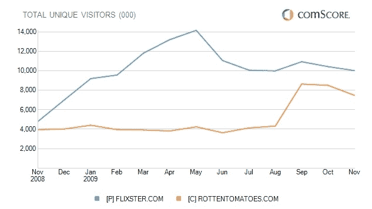

# 新闻集团在 Flixster | TechCrunch 上卸载烂番茄

> 原文：<https://web.archive.org/web/https://techcrunch.com/2010/01/04/rotten-tomatoes-flixster/>

# 新闻集团将烂番茄卸载到 Flixster 上

新闻集团正在出售更多的数字资产。这次是电影评论网站[烂番茄](https://web.archive.org/web/20230404075705/http://www.rottentomatoes.com/)，它被初创公司 Flixster 收购[，Flixster 拥有 iPhone 和其他移动设备上最受欢迎的电影应用。收购价格没有披露，但至少部分是股票交易。新闻集团现在拥有 Flixster](https://web.archive.org/web/20230404075705/http://www.businesswire.com/portal/site/home/permalink/?ndmViewId=news_view&newsId=20100104005980&newsLang=en)的少数股份，该公司仅筹集了总计 700 万美元的风险投资。

Flixster 已经在其 iPhone 应用程序中显示了烂番茄的评论和评级(你可以将烂番茄的评论与 Flixter 用户评论进行对比)。将两家公司放在一起当然会加强 Flixter。据两家公司称，在所有不同的平台上，每月有 3000 万独立访问者。单看他们的网站，Flixster 每月全球独立访客数为 1000 万，而烂番茄为 750 万(见下图)。

10 月，新闻集团以 6000 万美元的价格将 photo bucke t 出售给 Ontela。预计该公司今年将剥离更多数字业务。

*图片来源:Flickr/[【177】](https://web.archive.org/web/20230404075705/http://www.flickr.com/photos/banky177/490864796/)。*

