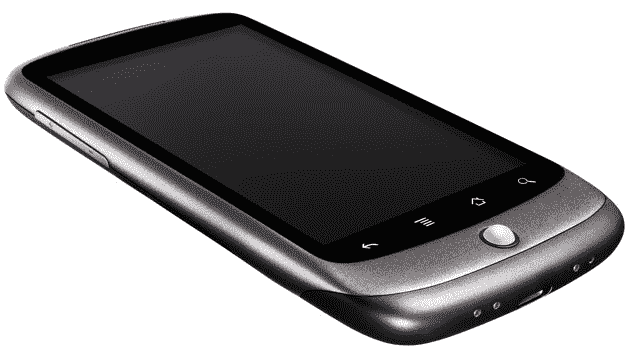

# 谷歌 Nexus One:TechCrunch 评论

> 原文：<https://web.archive.org/web/https://techcrunch.com/2010/01/05/google-nexus-one-the-techcrunch-review/>

昨天，谷歌并没有销售手机。今天，他们是。Google.com/phone 的[Nexus One](https://web.archive.org/web/20230301091419/http://www.google.com/phone)智能手机已经上市销售。我们在[活动的现场笔记在这里](https://web.archive.org/web/20230301091419/https://techcrunch.com/2010/01/05/nexus-one-event/)。

自 12 月中旬以来，我一直将 Nexus One 与 TMobile 配合使用，作为我的主要手机。这是迄今为止最好的安卓手机。它也是当今市场上最快、最优雅的智能手机，在大多数方面都击败了 iPhone。在这个快速发展的市场中，肯定会有更好的东西出现。但如果你现在想买一部高端智能手机，这款手机正适合你。Nexus One 是 Android 的标志性设备。

我们的完整评论如下。

### Nexus One:大图

与市场上的其他手机相比，这款手机看起来更像 iPhone。没有像 Android 驱动的[摩托罗拉 Droid](https://web.archive.org/web/20230301091419/http://www.crunchbase.com/product/droid) 那样的物理键盘，代价是更薄的设计。这款手机的厚度为 11.5 毫米，比 12.3 毫米的 iPhone 3GS 略薄。它也比 130 克的 iPhone 略轻。该套装配有手机、可拆卸电池、4 GB Micro SD 存储卡(可扩展至 32 GB)、USB 充电器和麦克风耳机。

Nexus one 在屏幕底部有四个功能性触摸按钮(后退、菜单、主页、搜索)和一个导航轨迹球定点设备。它也有物理电源和音量控制。但你与手机的大部分互动将通过华丽的 3.7 英寸 480 x 800 有机发光二极管电容式触摸屏进行。这是目前市面上最好的手机显示屏，吹走了 iPhone 的 480 x 320 显示屏。屏幕明亮而生动，使用起来绝对是一种享受。

这款手机还采用了骁龙 1 GHz 核心处理器，能够处理 Nexus One 的 3D 图形、后台运行的多个应用程序以及同时使用大量浏览器。与之前的 Android 手机不同，当你提升手机性能时，不会出现减速或延迟，也不需要关闭应用程序来保持设备运行。

不利的一面是:所有这些硬件都是能量猪。屏幕会自动调节亮度，谷歌很聪明地在不使用处理器时将其关闭。但我发现电池寿命短得可怜，即使按照 iPhone 的标准。根据官方说法，这款手机的通话时间长达 7 小时，待机时间为 250 小时，3G 互联网使用时间为 5 小时，视频播放时间为 7 小时，音频播放时间为 20 小时。非正式地，我能够在全亮度屏幕上用 1.5 小时的连续游戏(Robo Defense)杀死充满电的电池。准备好把手机放在充电器旁边。不过，你可以很容易地查看什么在使用电池(屏幕是我当前使用量的 71%)，然后调整硬件或软件的使用，以最大限度地延长电池寿命。

总的来说，Android 是一款优秀的移动设备，尤其是与谷歌语音配合使用的时候。谷歌称这是第一款超级手机。他们可能没有夸大其词。

### 价格和可用性

Nexus One 将于今日在 Google.com/phone[开始“大量”发售。可以在大多数国家使用的解锁版 GSM 手机售价为 529 美元。](https://web.archive.org/web/20230301091419/http://www.google.com/phone)

谷歌还通过 T-Mobile 提供这款手机的补贴版——也是无锁版——售价 179 美元。谷歌提供的服务方案是 500 分钟/无限短信/无限数据，80 美元/月。T-Mobile 的终止费是 200 美元，一些用户可能会禁不住诱惑，购买 T-Mobile 版本并立即终止，只需为解锁的手机支付 379 美元。然而，谷歌表示，过早终止的用户将被收取手机的全价。但是，即使是 T-Mobile 版本的手机，也可以通过插入不同的 SIM 卡在海外旅行中使用。

谷歌将向美国、英国、香港和新加坡的消费者发售解锁版手机。今年春天，他们说他们将通过威瑞森增加 CDMA 版本的手机，并通过沃达丰建立一个运营商计划的欧洲商店。

美国用户也可以通过美国电话电报公司使用解锁的手机，尽管手机的无线电不能使用美国电话电报公司的 3G 网络。

### 显著的软件功能

运行新的 Android 2.1 的 Nexus One 有许多显著的软件功能，使手机使用起来很愉快。

首先，谷歌语音与手机深度整合，所有安卓手机都是如此。这意味着你可以将你的谷歌语音号码分配给手机，并用它来拨打所有的电话和发送短信。在我看来，这是 Android 手机的最大卖点，也是为什么[我不会在短期内离开这个平台的原因](https://web.archive.org/web/20230301091419/https://techcrunch.com/2009/08/09/how-i-learned-to-quit-the-iphone-and-love-google-voice/)。

谷歌的语音键盘令人惊叹。它远远超出了 2009 年推出的语音搜索应用程序。设备中的每个文本字段现在都已启用语音。在大多数应用程序中，您可以选择麦克风按钮并与手机通话，然后手机会将您的语音转换为文本。我发现它在没有背景噪音的情况下，准确率在 90%左右(在移动的汽车中，准确率下降到 70%左右)。然后很容易输入和编辑出错误。这是手机节省大量时间的功能。

现场壁纸的特点是纯粹的眼睛糖果，和乐趣。您可以选择各种壁纸设置，如“草”(草的叶片在白天或夜晚的天空中轻轻摇曳)、“魔法烟雾”(我最喜欢的，以令人瞠目结舌的颜色绘制烟雾、云、水和等离子体)、“水”(触摸它，它会荡漾)和“极地钟”(以顺时针弧线显示日期和时间)。

新的时钟应用程序在充电器文档中自动运行，显示时间、当地天气，并有简单的按钮来访问闹钟、图片和音乐。在你的床边放一个充电器，扔掉闹钟。

谷歌还将提供一项设置备份服务，将个人资料、应用程序、铃声和其他设置备份到云中。使用备份服务后，安装一部新的安卓手机很容易。即使没有它，我也能在大约十分钟内用我的谷歌联系人、日历、电子邮件和重要应用程序设置好电话。

最后，谷歌增加了许多漂亮的图形处理，包括应用程序的 3D 滚动，以及一种使用柯立斯技术查看照片的新方法。照片浸入平面，因为它有深度。倾斜手机会触动加速度计，照片也会以同样的方式倾斜。

### 显著的硬件特性

手机最明显的硬件特征是 480 x 800 有机发光二极管电容式触摸屏。加上骁龙芯片组，手机是一个真正的工作狂。但谷歌也加入了其他不太好的内容。

噪声消除功能特别有用。该设备背面有第二个麦克风，可监控入站噪音并自动消除(任何在长途飞行中使用 Bose 噪音消除耳机的人都会喜欢)。在电话的另一端，它很好地抵消了机器和风的噪音。在我的测试中，接听电话的人注意到，无论是 Droid 还是 iPhone，这款手机的通话质量都有大幅提高。寻找其他手机来快速添加这个功能，这是必须的。

在下方，手机的主麦克风位于设备底部，左侧。我注意到，在通话时，当我不用手将手机放在脖子和肩膀之间时，我的声音经常很小，听不见。这是一个设计错误，应该在未来的版本中进行更改。

手机的摄像头真的很亮。它在设备背面有很大的占地面积，比大多数手机都大。这是一个带闪光灯的 500 万像素相机，但这个描述并不恰当。微距和弱光功能对于手机来说是顶级的。我在 TechCrunch 总部的会议室里，在没有闪光灯的昏暗光线下拍摄了这张照片。

这款手机有两个可用的坞站。两者都通过无摩擦的触摸点为设备充电。如上所述，普通充电器开启手机的时钟功能。汽车充电器打开谷歌导航，这是一个杀手级的安卓应用程序，可以把手机变成一个连接的导航设备。

### 谷歌，Nexus One 智能手机的供应商

Nexus One 是智能手机市场的一个重要里程碑。这是一家软件公司，对与硬件制造商的妥协感到沮丧，它不畏艰难地推出了产品。HTC 生产这款手机，但品牌主要是谷歌的，很明显，他们指导了这款手机开发的每一个方面。这是谷歌对完美 Android 设备的愿景，从巨大而美丽的屏幕和速度极快的骁龙处理器，到谷歌导航、动态壁纸和语音键盘的优雅软件。当与谷歌语音结合使用时，目前市场上没有手机可以媲美 Nexus One。

不像以前的 Android 手机，我也用过大部分，Nexus One 没有明显的缺陷或妥协。手机是移动中最先进的，我会愉快地使用它。就像我常说的，直到更好的出现。