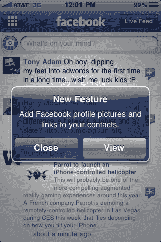
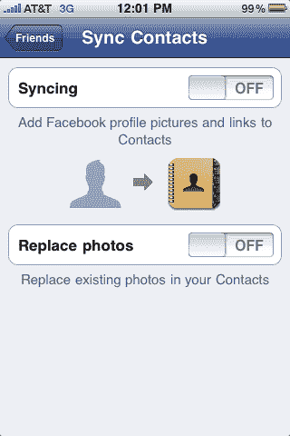

# 脸书的 iPhone 应用程序终于获得推送通知，联系人同步| TechCrunch

> 原文：<https://web.archive.org/web/https://techcrunch.com/2010/01/06/facebook-iphone-push-notifications/>

# 脸书的 iPhone 应用程序终于获得推送通知，联系人同步

随着乔·休伊特著名的[不再为脸书 iPhone 应用](https://web.archive.org/web/20230404073616/https://techcrunch.com/2009/11/11/joe-hewitt-developer-of-facebooks-massively-popular-iphone-app-quits-the-project/)工作，花费的时间比一些人预期的要长，但是今天一个新版本终于登陆了应用商店，推出了一个备受期待的新功能:推送通知。

虽然 3.0 版本的脸书应用程序很棒，可能是最好的 iPhone 应用程序之一，但和许多其他 iPhone 应用程序一样，它只有在被频繁使用时才有用。这是因为苹果显然不允许第三方应用在后台运行。当然，当你有新消息时，这个应用程序可以标记一个号码，但它没有真正的通知。

但有了全面的推送通知支持，这款应用变得更加有用，因为当朋友们在你的墙上发表评论或标记你的照片时，你可以通过弹出消息或声音获得通知。这使您能够更加被动地与脸书数据进行交互，并且仅当您想要主动查看或回应某些内容时才跳转到应用程序。

许多其他第三方应用程序实际上提供了脸书通知功能，特别是 Boxcar(我最喜欢的一个应用程序)，但这种原生支持允许更定制的体验。例如，您可以使用该应用程序为信息、墙贴、好友请求、好友确认、照片标签、事件和评论设置通知。

推送通知并不是 3.1 唯一的新特性。还有一种新方法可以让你的脸书朋友和你的 iPhone 通讯录同步。这包括更换联系人照片。相当漂亮。

**更新**:脸书已经通知我们，3.1.1 版本与 3.1 版本在同一天发布，以更新联系人照片同步的问题。我们被告知，现在这应该可以了。请务必下载新版本。

 