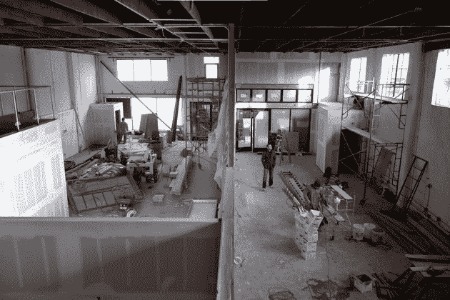
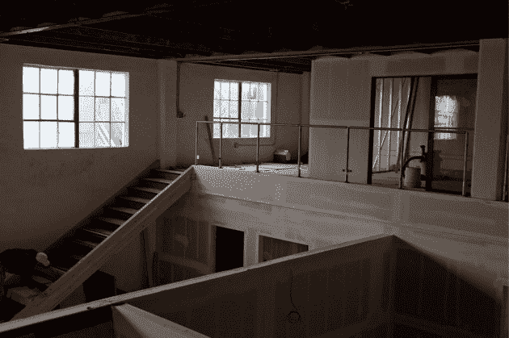

# i/o Ventures -一个工作/咖啡馆孵化器在旧金山启动| TechCrunch

> 原文：<https://web.archive.org/web/https://techcrunch.com/2010/01/06/io-ventures-incubator-san-francisco/>

一小群备受瞩目的初创公司高管正准备推出他们的下一个创业项目——一个名为 [i/o ventures](https://web.archive.org/web/20230404205614/http://www.ventures.io/) 的工作空间孵化器和天使投资基金，旨在帮助新创公司获得一些初始资本和一个凉爽的工作场所。该公司位于旧金山。

这四位合伙人包括前[阿伯·惠特科姆](https://web.archive.org/web/20230404205614/http://www.crunchbase.com/person/aber-whitcomb)(前 MySpace 首席技术官)[阿什温·纳文](https://web.archive.org/web/20230404205614/http://www.crunchbase.com/person/ashwin-navin)(BitTorrent 前总裁兼联合创始人，雅虎前企业发展执行官)[吉姆·杨](https://web.archive.org/web/20230404205614/http://www.crunchbase.com/person/jim-young)(联合创始人霍托尔诺特)[保罗·布拉吉尔](https://web.archive.org/web/20230404205614/http://www.crunchbase.com/person/paul-bragiel)(le fora 和 Meetro 的联合创始人)。

i/o ventures 是一座 7000 平方英尺的办公楼，位于旧金山巴伦西亚 [780 号](https://web.archive.org/web/20230404205614/http://maps.google.com/maps?client=safari&q=780+valencia+san+francisco&oe=UTF-8&ie=UTF8&hl=en&hq=&hnear=780+Valencia+St,+San+Francisco,+California+94110&ll=37.760512,-122.421782&spn=0.002888,0.003793&t=h&z=18)。大部分空间都被装修成了办公室，有 40 多张桌子和会议室。

任何人都可以以 150 美元/月/桌的价格在那里工作一天或更长时间(很划算)。问题是桌子是共享的，这意味着你每天可能会坐在不同的桌子上。你把你的东西放在柜子里。包括电和网络。

但 i/o ventures 的真正意义是孵化创业公司。他们在加速器项目中接受第一类创业公司的申请。你可以在他们的办公室里呆 4 个月(如果你需要的话，还可以再呆两个月)并获得 25，000 美元的启动资金。每一类中的五家公司都为了投资和空间放弃了“大约 8%”的股权。

i/o ventures 还提供一长串企业家和投资者的指导，这些企业家和投资者承诺会经常来访。我是这些导师中的一员，我计划每个月在他们的办公室工作几天(我不会因此得到任何形式的补偿)。

顶部的樱桃是 i/o ventures 咖啡馆，这是一家向公众开放的 2000 平方英尺的零售咖啡馆。咖啡馆大约在 2 月 1 日开门营业。

第一批创业公司将于 3 月 1 日进驻。在这里应用。你必须搬到湾区成为这个项目的一部分，你的生活费用是你的问题。合伙人告诉我，创始人绝对不能在 i/o ventures 里突然离开，因为那里没有被划分为住宅区。他们还指出，该地点有淋浴，并建议他们可以对办公室里奇怪的睡袋视而不见，这是非正式的。

团队发来了几张照片，展示了这个空间今天的样子(由[迈克·丘普林](https://web.archive.org/web/20230404205614/http://www.cmyksf.com/)拍摄)。今天没什么好看的，但是你可以想象一下它完工后的样子。我们还在他们的 CrunchBase [简介](https://web.archive.org/web/20230404205614/http://www.crunchbase.com/company/i-o-ventures)中添加了一张概念图。

