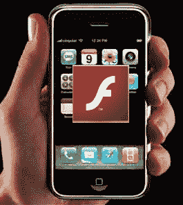

# 今年，Adobe 的 200 万 Flash 开发者将来到 iPhone TechCrunch

> 原文：<https://web.archive.org/web/https://techcrunch.com/2010/01/10/flash-developers-iphone/>

# 今年，Adobe 的 200 万 Flash 开发者将来到 iPhone

众所周知[苹果不喜欢 Flash](https://web.archive.org/web/20230115214450/http://www.crunchgear.com/2009/02/02/he-saidshe-said-flash-not-coming-to-iphone/) 。它不允许 Flash 应用程序在 iPhone 或 iPod Touch 上运行，尽管 Adobe 的哄骗和恳求，尽管它已经在实验室里工作了很长时间。iPhone 缺乏对 Flash 的支持，这对消费者和开发者来说都是一个很大的不便，也是 iPhone 武器库中的一个缺口。

但这一切都将改变，因为无论有没有苹果的支持，Adobe 都将把它的 200 万 Flash 开发者带到 iPhone 上。正如它在 10 月宣布的[，其 Flash 开发工具的下一个版本，Creative Suite 5(目前处于私人测试阶段)，将包括一个](https://web.archive.org/web/20230115214450/http://techcrunch.com/2009/10/05/adobe-shows-off-flash-apps-for-iphone-yes-you-read-that-right/)[“iPhone 打包器”](https://web.archive.org/web/20230115214450/http://labs.adobe.com/technologies/flashcs5/appsfor_iphone/)应用程序，它将自动将任何 Flash 应用程序转换成 iPhone 应用程序。因此，虽然 Flash 应用程序不能在 iPhone 上运行，但任何 Flash 应用程序都可以很容易地转换成 iPhone 应用程序。(微软对 Silverlight 采取了类似的方法)。这比许多人所理解的要重要得多。

Flash iPhone 争论的焦点主要集中在 Flash 是网络上事实上的视频标准。例如，每当你在 iPhone 浏览器中遇到一个带有 Flash 视频的网页时，手机必须打开一个单独的 Quicktime 播放器，而不是直接在浏览器中看到它。网络上的大多数视频，包括 YouTube 上的所有内容，都是通过 Flash 播放器显示的，所以这变得很乏味。苹果一直引用[技术原因](https://web.archive.org/web/20230115214450/http://www.cbc.ca/technology/story/2008/03/05/tech-adobe-iphone.html)来解释为什么不支持 Flash。它是一个电池猪，它对手机来说太慢，能力不够等等。其中一些问题是有效的，Adobe 已经[解决了](https://web.archive.org/web/20230115214450/http://www.mobilecrunch.com/2008/11/16/adobe-to-demo-flash-on-mobile-but-only-windows-still-working-on-the-iphone/)这些问题，以至于 Flash now [在 Android](https://web.archive.org/web/20230115214450/http://techcrunch.com/2009/06/24/flash-hits-android-when-will-apple-play-catch-up/) 上运行良好。

但是苹果在 iPhone 上不使用 Flash 还有一个更具战略性的原因。它希望有机会与开发者打成一片。当然，除了视频，Flash 还可以用来创建网络应用——那种在手机上看起来不错的应用。苹果不得不推迟 Flash，不是为了控制 iPhone 上的视频体验，而是因为它需要建立自己的由苹果控制的 iPhone SDK。它最不需要的就是一个相互竞争的开发者平台。

一旦 Adobe 公开发布 CS5，Flash 应用和视频仍然不能在 iPhone 上运行。但这 200 万开发者将能够继续使用 Adobe 工具，并简单地将它们自动转换成 iPhone 应用程序。相比之下，只有大约 125，000 名 iPhone 开发者。这将降低制作 iPhone 应用程序的门槛，甚至比现在更低，这可能是也可能不是一件好事。但如果你认为现在有很多 iPhone 应用程序，那就等着闪光闸门打开吧。