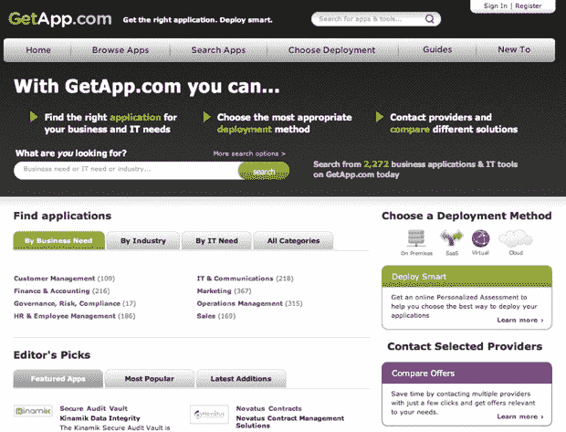

# GetApp.com 的目标是成为商业软件 TechCrunch 的首要“应用商店”

> 原文：<https://web.archive.org/web/https://techcrunch.com/2010/01/13/getapp-app-store-business-applications/>

# GetApp.com 的目标是成为商业软件的首要“应用商店”

今天，[GetApp.com](https://web.archive.org/web/20221006121357/http://www.getapp.com/)公开发布，旨在将自己定位为软件、SaaS 和基于云的商业应用的领先垂直门户。

GetApp 的前提相当简单:为(潜在的)专业 IT 服务和软件购买者提供一个浏览和研究业务工具的机会，为提供商提供一个在目录中找到的低成本方式，并指导双方充分利用这种体验。

作为购买者，您可以去 GetApp.com 寻找、比较和选择各种各样的商业应用程序，这些应用程序按照 IT 和商业需求以及行业进行分类。搜索功能非常强大，允许访问者将结果过滤到单个供应商或企业级应用程序。

为了从中立的角度帮助买家，GetApp 提供了用户生成的评论和免费的[个性化评估](https://web.archive.org/web/20221006121357/http://www.getapp.com/personalized_assessment)工具，以及大量关于该主题的[指南](https://web.archive.org/web/20221006121357/http://www.getapp.com/business_it_pro)。

应用程序提供商/ISV 可以使用 GetApp.com 来列出他们的工具，并有可能在网上接触到合格的买家，无论是免费的还是有更多选项的。这种免费增值模式和潜在客户的产生是 GetApp 商业模式的关键，尽管这个网站也有一些 PPC 广告。

在发布时，GetApp.com 推出了 300 多个类别的 2200 多个应用程序。

GetApp.com 是欧洲云、微软 BizSpark 合作伙伴网络和 Sun Startup Essential 社区的成员。该公司总部位于西班牙巴塞罗纳，由 Christophe prim ault(NCR 公司前全球营销副总裁，Fluiditi 和 Kinamik 公司首席执行官)和 Manuel Jaffrin(太阳微系统公司前欧洲业务总监)共同创立。

