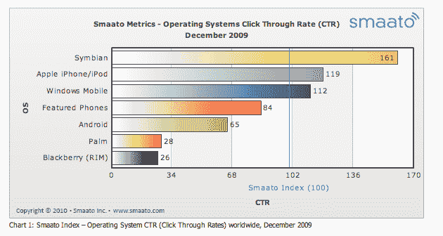
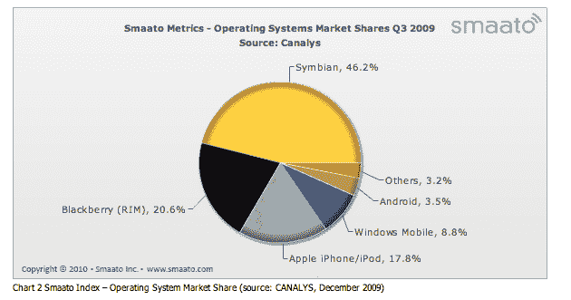

# iPhone 的移动广告点击率是 Android 的两倍；两者都被 Symbian TechCrunch 摧毁

> 原文：<https://web.archive.org/web/https://techcrunch.com/2010/01/13/iphone-android-symbian-click-rates/>

# iPhone 的移动广告点击率是 Android 的两倍；都被 Symbian 毁了

当你想到移动广告时，你可能会认为 iPhone 或 Android 是热门平台(感谢像这样的[广告)。但是你错了。](https://web.archive.org/web/20221006210622/http://www.beta.techcrunch.com/2010/01/13/iphone-music-video-ad/)

来自移动广告公司 [Smaato](https://web.archive.org/web/20221006210622/http://metrics.smaato.com/) 的一些新的 12 月数据表明，实际上是 Symbian 杀死了 iPhone 和 Android。现在，我知道你在想什么:这是因为诺基亚，尽管围绕着更性感的智能手机设备的嗡嗡声，仍然是世界上最大的手机玩家。但实际上，这些数字是各种平台上最重要的点击率。

正如你在下面的图表中看到的，所有移动平台广告的平均点击率为 100，Symbian 以 161 的分数遥遥领先。紧随其后的是 iPhone(和 iPod touch)的 119。安卓？他们以 65 分排名垫底。只有 Palm 和黑莓表现更差。

那么为什么 Symbian 在点击率方面做得这么好呢？Smaato 怀疑这可能与诺基亚设备在新兴市场的高度饱和有关。但他们也指出，塞班在美国的点击率更高，尽管规模要小得多，因为诺基亚在这里远没有那么受欢迎。

就总体使用情况而言，Smaato 追踪的手机中，Symbian 占了 46.2%。RIM(黑莓)以 20.6%的份额位居第二，但 iPhone 在经历了今年的巨大增长后，以 17.8%的份额迅速赶上。但是 Smaato 预计 Android 将在 2010 年成为主要的推动者，很可能从现在的 3.5%上升到年底的 10%以上。

报告中还有一些有趣的事情:Quattro Wireless 与 Millennial Media 并列为美国表现最好的移动广告网络。这一点很重要，因为在谷歌从他们手中抢走 AdMob 后，苹果刚刚收购了 Quattro。Smaato 在其报告中没有具体说明 AdMob 的数据。

*【图片:Flickr/*[*jm3*](https://web.archive.org/web/20221006210622/http://www.flickr.com/photos/jm3/756711755/)