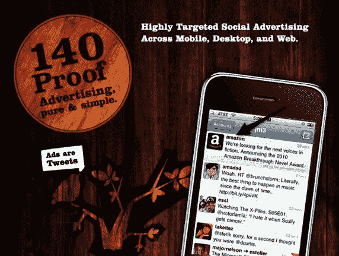

# 140 Proof 提炼出 Twitter TechCrunch 的广告网络

> 原文：<https://web.archive.org/web/https://techcrunch.com/2010/01/20/140-proof-rolls-out-ad-network-for-twitter-clients/>

# 140 证明提取 Twitter 的广告网络

我们都在焦急地等待 Twitter 将如何在其微博平台上打开广告。我们知道 Twitter 今年将在[整合自己的](https://web.archive.org/web/20221210061029/http://www.beta.techcrunch.com/2009/11/20/twitter-ads/)广告，目前[正在](https://web.archive.org/web/20221210061029/http://www.businessweek.com/news/2010-01-20/twitter-operating-chief-dick-costolo-says-ipo-still-way-out-.html)与广告商谈判，但我们还不知道这会是什么样子。与此同时，其他初创公司也出现了针对 Twitter 的广告模式，包括 [Ad.ly、](https://web.archive.org/web/20221210061029/http://www.beta.techcrunch.com/2009/12/17/ad-ly-launches-analytics-for-sponsored-tweets/) [Assetize](https://web.archive.org/web/20221210061029/http://www.assetize.com/) 、 [SponsoredTweets、](https://web.archive.org/web/20221210061029/http://sponsoredtweets.com/)和 [Magpie。](https://web.archive.org/web/20221210061029/http://be-a-magpie.com/en/)去年 11 月， [Robert Scoble](https://web.archive.org/web/20221210061029/http://www.crunchbase.com/person/robert-scoble) 向我们展示了一个引人注目的 Twitter 广告模型，叫做[超级推文。](https://web.archive.org/web/20221210061029/http://scobleizer.com/2009/11/20/twitter-to-turn-on-advertising-you-will-love-heres-how-supertweet/)

现在，初创公司 [140 Proof](https://web.archive.org/web/20221210061029/http://140proof.com/) 正加入其基于 Twitter 的广告网络。该网络完全绕过 Twitter 的网站，允许第三方 Twitter 客户向广告商出售网络空间。这些广告出现在第三方 Twitter 客户端，这些客户端使用 140 Proof 的 API 来提供和衡量他们的广告。广告在这些客户端(移动、桌面或网络)上的用户 Twitter 流中提供，并明确标记为广告。

和 140 个证明承诺定向广告。Twitter 客户端传递 140 用户 ID 列表(没有名字)和包含在 Twitter 用户简档中的公共信息，并且在广告客户方，广告客户基于 tweets 中的关键字、关注者以及设备、位置和平台对定向到用户的广告进行竞价。140 Proof 的算法根据公开推文和他们关注的人来计算 Twitterer 的“角色”，并根据这些数据向用户提供广告。因此，如果我的许多推文中有“红酒”这个词，140 度的酒精度会让我成为葡萄酒制造商的理想目标。

与传统广告网络类似，广告商按点击付费，加上转发和直接回复被视为免费奖金。广告商可以通过自助服务界面创建自己的广告推文，定义特定的 Twitter 角色，然后通过点击、转发和@回复来衡量广告活动的效果。140 Proof 已经签下了一些较小的开发者，最近还带来了一个主要的 Twitter 客户端开发者，但拒绝透露初创公司的名称。该网络的平台上有 40 多个广告商，并且每天都在增加大大小小的业务。

在 BlueRun Ventures 和 T2 创始人基金 200 万美元投资的支持下，140 Proof 可能会帮助许多 Twitter 客户端开发者通过广告将其应用货币化。当谈到 Twitter 时，货币化是一个令人困惑的问题，所以这个网络可以为广告商和开发者提供一种利用流来赚钱的方式。OneRiot 正在用它的实时广告网络 [RiotWise，](https://web.archive.org/web/20221210061029/http://www.beta.techcrunch.com/2010/01/15/oneriots-realtime-ad-network-riotwise-now-open-to-the-masses/)做类似的事情，并且在它的私人测试中看到了有希望的结果。Seesmic 似乎正在开发一个涉及品牌广告的秘密应用程序，名为 Look，将于明天发布。

这家初创公司向在这里注册的前 50 名 TechCrunch 读者提供 100 美元的免费 Twitter 广告。