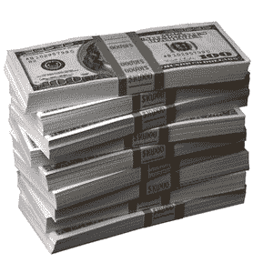

# 谷歌联合创始人计划在未来五年出售多达 1000 万股 TechCrunch

> 原文：<https://web.archive.org/web/https://techcrunch.com/2010/01/22/google-co-founders-plan-sell-10-million-shares/>

# 谷歌联合创始人计划在未来五年内出售至多 1000 万股股票

据美国证券交易委员会(SEC)提交给 T2 的文件显示，谷歌联合创始人拉里佩奇和谢尔盖布林计划在未来 5 年稳步抛售至多 1000 万股谷歌股票。以今天 550 美元的收盘价，如果立即出售，这些股票将价值 55 亿美元。虽然这两位联合创始人拥有 B 类股的超级投票权，但如果他们将这 500 万股全部卖掉，他们的投票权将从现在的 59%下降到 48%。从文件来看:

> Larry 和 Sergey 目前持有约 57.7 百万股 B 类普通股，相当于谷歌已发行股本的约 18%和谷歌已发行股本投票权的约 59%。根据该等规则 10b5-1 交易计划之条款，且作为五年多元化计划之一部分，Larry 及 Sergey 各自拟出售约 500 万股股份。如果 Larry 和 Sergey 完成了这些 10b5-1 规则交易计划下的所有计划销售，他们将继续共同持有约 47.7 百万股股票，相当于谷歌已发行股本的约 15%和谷歌已发行股本投票权的约 48%(假设没有其他谷歌股本销售和转换发生)。

它们仍将是最大股东，但无法像如今这样控制任何股东投票的结果。当然，他们可能在失去控制权之前就决定停止抛售。如果他们需要的话，还可以从 CEO 埃里克·施密特或者其他谷歌员工和忠实投资者那里获得另外 2%的选票。

这两家公司尚未按照计划开始出售股票，但科技公司创始人以这种方式分散持股很常见。例如，比尔·盖茨和 Salesforce 首席执行官马克·贝尼奥夫就出售了他们根据类似计划创立的公司的股票。通过定期抛售，它们可以套现，分散持股，而且不会因为突然抛售而吓到投资者。