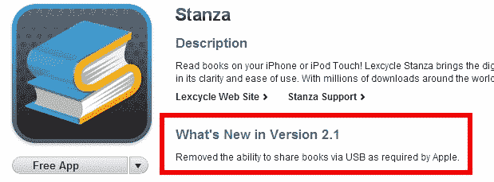

# 苹果要求移除 Stanza iPhone 应用 TechCrunch 中的 USB 共享功能

> 原文：<https://web.archive.org/web/https://techcrunch.com/2010/02/02/apple-stanza-usb/?utm_source=feedburner&utm_medium=feed&utm_campaign=Feed%3A+Techcrunch+%28TechCrunch%29>

# 苹果要求移除 Stanza iPhone 应用程序中的 USB 共享功能

像许多人一样，我在 iPhone 上安装了 [Stanza 应用](https://web.archive.org/web/20221209000009/http://www.lexcycle.com/iphone)。Stanza 由[lecycle](https://web.archive.org/web/20221209000009/http://www.lexcycle.com/)(去年[被亚马逊](https://web.archive.org/web/20221209000009/http://www.lexcycle.com/lexcycle_acquired_by_amazon)收购)制作，是一款适用于 iPhone 和 iPod Touch 的免费应用程序，它是一个通往超过 10 万本电子书的图书馆的门户，便于在旅途中阅读。

昨晚，我被提示将应用程序更新到新版本(2.1)，像往常一样，我检查了有什么变化。附带的信息非常简短:“移除了通过 USB 共享书籍的功能”。

我认为这是一个奇怪的更新，但没有想太多，因为我实际上没有使用该功能，只是下载并安装了新版本。

仅供参考:该功能使用户能够使用 USB 电缆将 ePub 或电子书阅读器格式的书籍传输到他们的移动设备[。](https://web.archive.org/web/20221209000009/http://www.lexcycle.com/faq/how_to_get_books_onto_stanza_iphone#sharing_via_usb)

今天早上，我们从一些对 Lexcycle 从 Stanza 应用程序中移除 USB 共享功能感到愤怒或惊讶的人那里获得了一些提示。我在 iTunes Store 中查找该应用程序，看到更新通知现在写着“根据苹果公司的要求，删除了通过 USB 共享书籍的功能”。浏览 Lexcycle 网站上的论坛可以发现，用户对这款应用的下架非常不满，只有一些人暗示苹果可能与此有关，并解释了他们为什么会要求下架。

我问 Lexcycle，苹果是否以及为什么通过电子邮件要求从 iPhone 应用程序中删除该功能，很快收到了简短的回复，说苹果确实要求 Lexcycle 从 Stanza 中删除该功能。我要求提供更多信息，但随后被 Lexcycle 告知“严禁讨论我们与苹果在此事上的对话细节”。

我相信苹果有充分的理由阻止人们使用 USB 线将文件传输到 iPhone 和 iPod Touch 设备，我相信这不是第一次[T2](https://web.archive.org/web/20221209000009/http://www.macobserver.com/tmo/article/usb_feature_returns_to_fileapp/)时间他们要求具有这种或类似功能的应用程序的开发者为新用户删除它们。也就是说，我不是 100%确定这里违反了哪些规则，而且由于苹果要求 Lexcycle 不要讨论细节，我们只能猜测为什么 Cupertino 在 USB 同步功能上有问题。

**更新:**

myPod Apps 公司的 Chris Devor 开发了用于 USB 文件传输的 iPhone Explorer 程序 Stanza，他告诉洛杉矶时报:

> 从 iPhone 应用程序开发的角度来看，你可以访问两个目录:(1)你的应用程序的沙箱文件夹，以及(2)用于访问图片等的 DCIM 目录。在非越狱的 iPhone 上，iPhone Explorer 可以访问 DCIM 目录，但不能访问应用程序沙箱。因此，我们在 DCIM 目录中创建了一个子文件夹，作为两个程序的公共基础或共享文件夹。
> 
> 当我们开始这样做的时候，我们认为我们处于 iPhone 应用程序开发的“灰色地带”,这是苹果没有正式表明立场的事情。一旦《好读者》登上全球排行榜榜首，它就吸引了很多人的关注，苹果认为我们不怀好意。在 iPhone 应用程序开发者和苹果记者之间的一系列电子邮件往来之后，结论如下:
> 
> (1)iPhone 应用程序必须删除对 DCIM 目录的访问权限(苹果声称这违反了 iPhone 应用程序开发者协议)
> (2)开发者不应该责怪(指责)苹果被迫删除对该文件夹的访问权限(因此 Stanza 没有做出解释)。

苹果公司的[迈克尔·朱雷维兹](https://web.archive.org/web/20221209000009/http://www.linkedin.com/in/michaeljurewitz)也在推特上加入了[的观点，他说:“事实很简单 iPhone 应用程序没有通过 USB 线同步的公共 API”。他说](https://web.archive.org/web/20221209000009/http://twitter.com/jurewitz/status/8550289908)[补充说](https://web.archive.org/web/20221209000009/http://twitter.com/jurewitz/status/8551474584)人们可以自由地提交增强请求。(通过 [MacWorld](https://web.archive.org/web/20221209000009/http://www.macworld.com/article/146083/2010/02/iphone_usbsync.html)

自然，这一事件为许多声称苹果控制欲太强的观察人士火上浇油，而且鉴于两家公司在电子阅读器/电子书领域的竞争[加剧](https://web.archive.org/web/20221209000009/http://www.beta.techcrunch.com/2010/01/28/top-10-reasons-ipad-kindle/)，他们针对亚马逊公司似乎也很可疑。但在我看来，这是一个小的、非必要的功能，他们拿走了，[没有将应用](https://web.archive.org/web/20221209000009/http://www.iphonefreak.com/2010/02/stanza-for-the-iphone-gets-updated-you-may-want-to-hold-off-on-updating-this-one.html)更新到新版本，为那些认为它重要到足以引发任何麻烦的人保留了 USB 共享功能。

你认为苹果在限制 iPhone 应用程序方面走得太远了吗，或者你认为他们有权对整个过程进行尽可能多的控制吗？评论区都是你的。