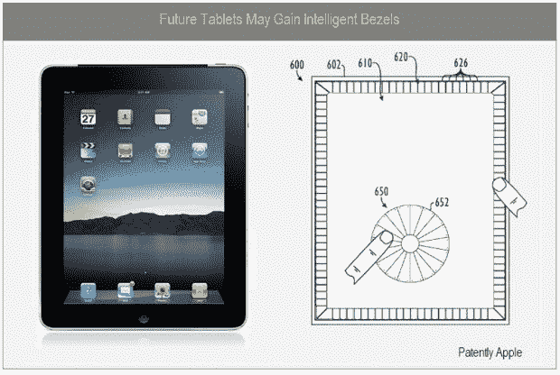
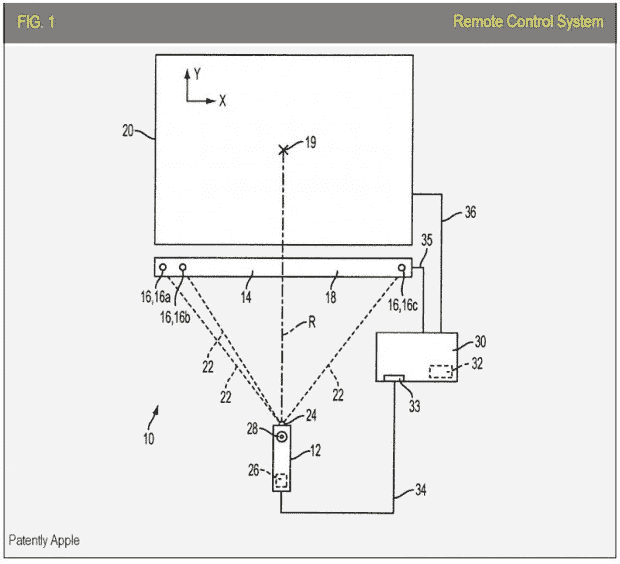

# Mac-in-news 早间综合报道:触摸我的边框

> 原文：<https://web.archive.org/web/https://techcrunch.com/2010/02/03/mac-in-news-morning-round-up-touch-my-bezel/>

# Mac-in-news 早间综合报道:触摸我的边框

专利专利专利！好的。只有两个。[苹果](https://web.archive.org/web/20230322164148/http://crunchgear.com/tag/apple)可能会在 [iPad 的](https://web.archive.org/web/20230322164148/http://crunchgear.com/tag/ipad)边框上增加[触摸感应](https://web.archive.org/web/20230322164148/http://www.patentlyapple.com/patently-apple/2010/02/apple-granted-patent-for-next-generation-apple-tv-technology.html)角(虽然不是目前的版本)，这可能会考虑到热角。这些可以通过屏幕上弹出的小旗来识别。
 
接下来呢？一个聪明的[小技巧](https://web.archive.org/web/20230322164148/http://www.patentlyapple.com/patently-apple/2010/02/apples-ipad-may-gain-an-intelligent-bezel-in-the-future.html)可能会给苹果电视增加类似 Wii 的功能，并感知电视前面遥控器的位置。

哦。而他们只是[专利的滑动解锁。](https://web.archive.org/web/20230322164148/http://patft.uspto.gov/netacgi/nph-Parser?Sect1=PTO2&Sect2=HITOFF&p=1&u=%2Fnetahtml%2FPTO%2Fsearch-bool.html&r=1&f=G&l=50&co1=AND&d=PTXT&s1=%22Apple+Inc%22&OS=%22Apple+Inc%22&RS=%22Apple+Inc%22)所以有三项专利。