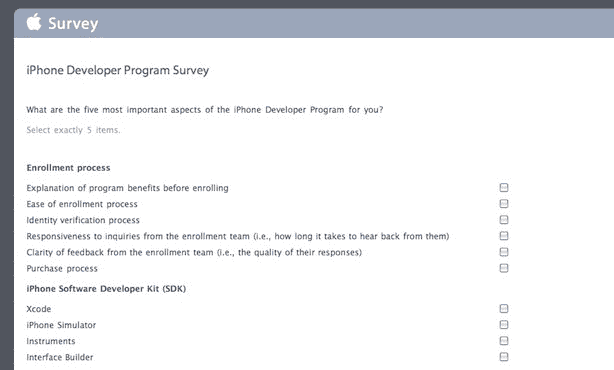

# 苹果调查 iPhone 开发者对应用商店 TechCrunch 的满意度

> 原文：<https://web.archive.org/web/https://techcrunch.com/2010/02/08/apple-app-store-survey/>

# 苹果调查 iPhone 开发者对 App Store 的满意度

去年，不乏开发者在抱怨苹果的 App Store。情况变得如此激烈，以至于不亚于苹果全球产品营销高级副总裁菲尔·席勒[亲自参与](https://web.archive.org/web/20221209132310/https://beta.techcrunch.com/2009/08/15/phil-schiller-is-a-man-on-a-mission-to-save-the-app-store/)与许多有问题的开发者的交涉。自那以后，投诉似乎已经平息了不少，但苹果公司仍在这个案子上。

该公司已经开始向 iPhone 开发者发送一份调查，询问他们对该程序的体验。虽然长时间的调查涵盖了一系列的事情，但大多数问题都是关于申请审查过程，以及开发人员对该计划的总体满意度。

提问的例子包括:

> 请评价您对应用程序提交流程(使用 iTunes Connect)的以下各个方面的满意度。
> 
> 请评价您对申请审核流程(使用 iTunes Connect)的以下各个方面的满意程度。
> 
> 请评价您对在 App Store 上获得更新所需时间的满意程度。

苹果让你用“非常不满意”、“有些不满意”、“既不满意也不满意”、“有些满意”、“非常满意”或“不知道”来回答。

他们还问，“*苹果可以做哪一件事来改善 iPhone 开发者计划？*“并且给你一个文本框让你写任何你想写的东西。几个月前，他们肯定会在那里得到一些有趣的回应。

今年年初的某个时候，苹果对 App Store 的审批流程进行了一些修改，这大大加快了许多开发者的工作速度。事实上，许多开发人员指出，在某些情况下，审批流程等待时间从两周(甚至更长)到几天。还有报告称，应用审查团队的沟通有所改善。

在过去的几个月里，苹果似乎为其应用审查团队配备了人员，并为他们提供了更好的培训和指导。不过，如果 App Store 继续以惊人的速度增长，很难想象事情不会再次陷入困境。因此，在这段相对和平的时期，苹果公司调查其开发者来微调系统是明智的。

