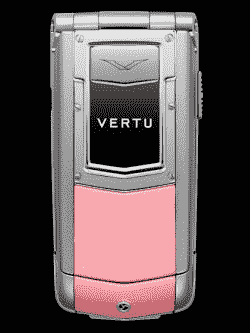

# 灵光一现，Vertu 为情人节准备了粉色手机 TechCrunch

> 原文：<https://web.archive.org/web/https://techcrunch.com/2010/02/08/in-a-stroke-of-genius-vertu-preps-pink-phone-for-valentines-day/>

# Vertu 灵机一动，为情人节准备了粉色手机

Vertu ，法语“美德”的意思，有一款粉色手机*正好赶上情人节*。这是[星座 Ayxt](https://web.archive.org/web/20221006185452/http://www.luxury-insider.com/Current_Affairs/post/2010/02/06/Vertu-Goes-Pink-for-Constellation-Ayxta.aspx) ，只是它是粉红色的。令人着迷。

关于这款手机，真的没有太多可说的。它最初于去年年底推出，这是 Vertu 的第一款“折叠手机”，肯定会给生活在 2006 年的人留下深刻印象。

我大胆猜测一下:如果你在情人节给你的女朋友买了一部粉红色的手机，你可能是个混蛋。