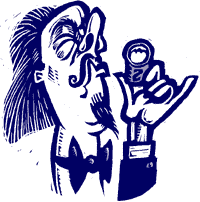

# 泰德:现在有了更多的精英主义？TechCrunch

> 原文：<https://web.archive.org/web/https://techcrunch.com/2010/02/09/ted-now-with-more-elitism/>

 让我先说一句:我从未去过 [TED](https://web.archive.org/web/20230130100805/http://www.ted.com/) ，主要是因为我从未被邀请过，我无法想象我有理由为一场会议支付 6000 美元。但我住在硅谷，所以每年在这个众星云集的活动之前，我都不得不从几乎所有我认识的人那里听到这个消息:喜欢它的人和讨厌它的人。

在过去的几年里，这些对话变得很糟糕。我在外面的所见所闻描绘了一个悲伤的转变，从过去一个有创意的、精英的行业会议，来自技术、娱乐和设计领域的专家们相互交流，到一个 6000 美元的、总是销售一空的邀请，除非你与名人擦肩而过，谈论你*真的*是一个多么富有同情心的百万富翁。

我真的不怪出席者。说实话，如果我有 6000 美元，而我的抵押贷款或一个有价值的慈善机构并不需要它，但它足够重要，值得组织者去争取，我可能也会成为一个 ted 头。但是几年前，我听到了太多关于不太重要的人的待遇的丑陋故事，以至于我最终不得不在我有史以来阅读量最高的商业周刊专栏之一中呼吁召开这个奉承会议，几乎保证我永远不会被允许进入它神圣的大门。这里满满的夸夸其谈。酸葡萄？大概吧。但是话说回来，有很多我不被允许参加的会议，我对此完全没有意见。

自从那次咆哮之后，我不情愿地给了泰德一些信任，因为他稍微开放了一些。搬到长滩给了会议一个更大的场地，更多真正想去的人似乎能买到票。ted 演讲现在可以在网上免费发布，有些甚至是会议的流媒体。TED 还将其活动扩展到了新兴世界，甚至赞助了一些买不起门票的当地人。

所以想象一下，当我开始听到来自硅谷的 ted 忠实听众的抱怨，说搬迁到长滩破坏了大会的伟大之处，使它变得更加精英化时，我有多惊讶。泰德一直是一个昂贵的小团体，但一旦你加入，你就加入了。就像在达沃斯的世界经济论坛一样，在 TED 的老家蒙特雷也没什么可做的，所以每个人都混在一起。这是一个罕见的地方，你可以在同一个晚宴上与阿尔·戈尔和梅格·瑞恩一起出去，拜托，这有点酷，对吧？

不会了。现在，当一天的会议结束时，整个洛杉矶地区都有严格的名单和安全措施。派系中的派系，如果你愿意的话。昨天和我聊天的一个朋友告诉我，去年太糟糕了，他甚至大部分时间都不能和朋友出去玩。因为当你花了 6000 美元参加一个活动时，这就是你想要的——被告知你的朋友仍然比你好。

公平地说，这些不一定是正式的 TED 活动。但是听到 TED 的忠实粉丝们抱怨 TED 的小团体，仍然令人震惊。