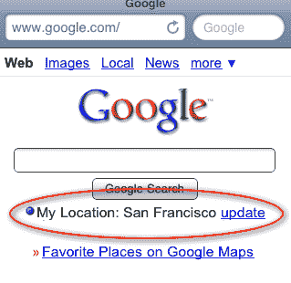

# 品牌没有浪费时间与谷歌 Buzz。这可能会很烦人。TechCrunch

> 原文：<https://web.archive.org/web/https://techcrunch.com/2010/02/10/google-buzz-spam-brands/>

# 品牌没有浪费时间与谷歌 Buzz。这可能会很烦人。

当谈到脸书和 Twitter 时，品牌们花了一段时间才明白如何利用社交网络。有了 Foursquare，[他们已经快得多了](https://web.archive.org/web/20220927215343/https://beta.techcrunch.com/2010/02/08/foursquare-mainstream-deals/)。但是现在有了 Google Buzz，他们击败了许多早期用户。

三星已经在今天早上建立了谷歌 Buzz 账户，并且已经开始生产 Buzz。不仅如此，他们显然正试图在这项服务上开创自己的潮流，因为他们今天标记了一堆他们“最喜欢的嗡嗡声”，并将嗡嗡声标记为“#BUZZwednesday”。当然，这里的问题是 Google Buzz 不像 Twitter 那样支持“#”符号(至少现在还不支持)。不过，你可以在 buzz(就在 Gmail 中)搜索“ [#BUZZwednesday](https://web.archive.org/web/20220927215343/https://mail.google.com/mail/#buzz/search/%23buzzwednesday) ”这个词，三星的 Buzz 就会出现。

当然，Buzz 标签机制的恼人之处在于，如果你被提到，它会自动将这些邮件发送到你的 Gmail 收件箱。

希望每个人都准备好迎接服务品牌的冲击！需要我提醒你 Google Buzz 昨天刚刚推出？

**更新**:三星回应:

郑重声明，我认为品牌尽早使用这些服务是明智的——这只是三星在做自己的工作。但我想我们都可以看到这将很快变得令人讨厌。

**更新 2** :三星补充道:“*我们同意将信息发送到收件箱并不理想。我们需要一个@回复和 DM 部分。甚至可能是评论、喜欢和最喜欢的部分*。我认为这是个好主意。

