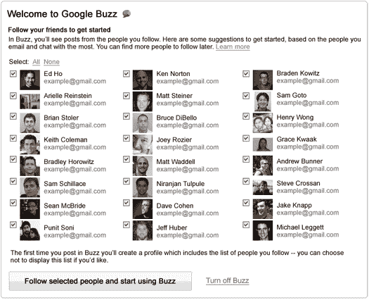
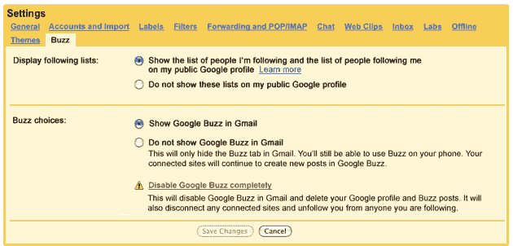

# 出于隐私考虑，Google Buzz 放弃自动跟踪技术

> 原文：<https://web.archive.org/web/https://techcrunch.com/2010/02/13/google-buzz-privacy-update/?utm_source=feedburner&utm_medium=feed&utm_campaign=Feed%3A+Techcrunch+%28TechCrunch%29&utm_content=Google+Reader>

# 出于隐私考虑，Google Buzz 放弃自动跟踪

正如我们今天早上在注意到的，谷歌没有浪费任何时间来回应用户对 Buzz 的批评。现在，他们推出了另一套[变化](https://web.archive.org/web/20221205085610/http://gmailblog.blogspot.com/2010/02/new-buzz-start-up-experience-based-on.html)，以进一步解决巴斯的隐私问题。最大的变化涉及自动关注系统:它现在被切换到一个建议模式，谷歌将为你提供一个它认为你想关注的朋友列表，但在你开始使用这项服务之前，你有机会取消选择他们。

这是一个相当大的变化——当 Buzz 在四天前推出时，它的卖点之一是用户无需做任何工作就可以开始使用，因为 Buzz 会自动关注你在 Gmail 上互动最多的人。当然，这并不总是一件好事——在很多情况下，你不希望别人知道你和谁联系过。在最初的强烈反对后，谷歌更容易隐藏你在跟踪哪些用户，但现在他们完全抛弃了自动跟踪模式。幸运的是，浏览这些建议只需要一分钟，所以这不是什么大问题。

新用户将会看到如上所示的屏幕，谷歌的帖子称，现有 Buzz 用户将在未来几周内看到这种朋友选择屏幕的版本，以确认他们对自己关注的每个人都感到满意。该服务还将停止自动连接谷歌阅读器和 Picasa 相册到 Buzz 账户，尽管这些选项仍然可用。

最后，谷歌在 Gmail 的设置中增加了 Buzz 部分。我不明白为什么一开始就没有这个功能——在此之前，如果你想调整 Buzz 设置，你必须进入你的谷歌账户页面，这没有什么意义，因为大多数人都是从 Gmail 使用 Buzz。

今天早些时候，谷歌对 Buzz 的隐私设置进行了又一次修改，修复了一个可能导致用户无意中暴露好友隐私的漏洞。

所有这些对 Buzz 来说都是好的变化，我对它的未来持乐观态度，但我不禁想知道它们是如何通过为期[个月](https://web.archive.org/web/20221205085610/https://beta.techcrunch.com/2010/02/09/sergey-brin-google-buzz/)的内部测试的。