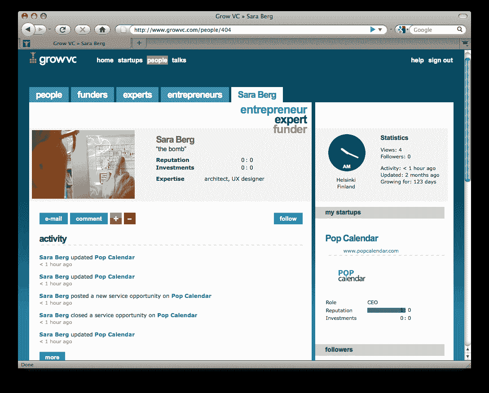

# Grow VC 成立，旨在成为科技创业公司的 Kiva

> 原文：<https://web.archive.org/web/https://techcrunch.com/2010/02/15/grow-vc-launches-aiming-to-become-the-kiva-for-tech-startups/>

# Grow VC 成立，旨在成为科技创业公司的 Kiva

Kiva 是一个 p2p 贷款网站，帮助富裕国家的贷款人和发展中国家的企业家之间进行贷款。现在，一家新的创业公司旨在为发达国家的创业公司带来类似的模式，但侧重于投资。这里的想法是解决目前网络和移动公司的私人种子资金效率低下的问题，特别是在硅谷以外的市场(即欧洲和亚洲)。

[Grow VC](https://web.archive.org/web/20230308124817/http://www.growvc.com/main/) 是一种针对科技创业公司的新型社区融资模式。它是这样运作的:Grow VC 将把 75%的会员费汇集到一个社区基金中，该基金将被投资回该平台成员中的“有前途的初创公司”。该基金由 Grow VC 管理，但所有投资决策都由会员做出，他们决定如何将自己的基金份额投资到他们认为最有潜力的其他初创公司。当社区基金开始获得投资回报时，最成功的决策者会得到经济上的回报。所以，如果你推广最好的公司，你就赚了钱。

加入 Grow VC，建立个人档案等基本功能都是免费的。高级功能的订阅费用从每月 20 美元到 140 美元不等，取决于初创公司寻求的资金或投资者希望投资的金额。对于无限服务投资，每月订阅费为每月 90 美元。该基金面向需要 1 万至 100 万美元的初创企业。

该服务声称包括从零开始建立一个创业公司所需的工具，以获得种子级别的资金。是的，这是一个很大的主张，但需要一些创业公司来检验这个平台是否能支撑下去。在这个领域还有其他人在玩，比如最近的[Sprouter.com](https://web.archive.org/web/20230308124817/http://sprouter.com/)，但 Grow VC 可能是我迄今为止见过的最雄心勃勃的。

它拥有的功能列表包括:向投资者、专家和其他企业家介绍初创公司；帮助他们发现共同兴趣和成员排行榜。该平台正在申请专利。

过去几个月，它一直处于公开测试阶段，已经有来自创业和投资社区的 700 名注册用户。

Grow VC 联合创始人兼首席执行官 Valto Loikkanen 表示，其模式让初创公司熟悉“整个投资过程……我们的成功取决于我们社区中其他初创公司、投资者和专家的成功。”

联合创始人兼董事长 Jouko Ahvenainen 正确地指出，“早期融资需要新的解决方案。风险投资正在将他们的注意力转移到更成熟的公司，有限合伙人正在减少对风险投资基金的投资。企业家希望融资市场有更多的竞争和透明度，而商业天使需要更好的工具来找到好的初创公司，并更容易达成交易。”

这是公平的评论，这正是现在正在发生的事情。问题是 Grow VC 是否是正确的模式。我想我们很快就会知道了。