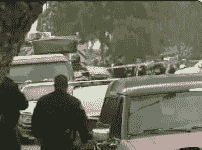

# 飞机失事导致三名特斯拉员工死亡，帕洛阿尔托停电

> 原文：<https://web.archive.org/web/https://techcrunch.com/2010/02/17/plane-crash-tesla-power-palo-alto/>

# 飞机失事导致三名特斯拉员工死亡，帕洛阿尔托停电

一架小型塞斯纳双引擎飞机[今天在东帕洛阿尔托](https://web.archive.org/web/20230319123458/http://www.sfgate.com/cgi-bin/article.cgi?f=/c/a/2010/02/17/BA391C32O5.DTL)坠毁，三名[特斯拉汽车](https://web.archive.org/web/20230319123458/http://www.teslamotors.com/)员工遇难，城市部分地区停电。飞机从帕洛阿尔托机场起飞，据报道撞上了一些电线。机上人员的姓名尚未公布。这架飞机注册在特斯拉高级工程师道格·伯恩(Doug Bourn)名下。目前还不清楚他是否是“特斯拉的高级官员”[驾驶飞机](https://web.archive.org/web/20230319123458/http://jalopnik.com/5473942/)或者他是否在飞机上。

地面上没有人受伤，但是两所房子着火了，包括一所用作日托中心的房子。幸运的是，事故发生时日托中心是空的。

Barron's 的 Eric Savitz 一整天都在更新关于事故的博客。这似乎是帕洛阿尔托大范围停电的原因，停电影响了脸书的办公室和许多初创公司。例如，帕洛阿尔托的 TechCrunch 总部仍然停电(尽管我们的网站仍然在运行，因为我们的服务器不在那里)。

这架飞机飞往洛杉矶，是一架 1976 年生产的老式塞斯纳 310 飞机。

**更新**:特斯拉给我们发来了首席执行官埃隆·马斯克的以下声明:“今天凌晨，三名特斯拉员工登上了一架在东帕洛阿尔托坠毁的飞机。我们正在隐瞒他们的身份，因为我们与有关当局合作，以通知家属。我们的思念和祈祷与他们同在。特斯拉是一家小型、紧密团结的公司，对我们来说，这是悲惨的一天。”