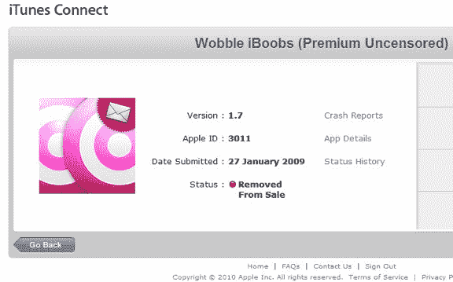

# 苹果刚刚禁止了 App Store 中的色情内容吗？TechCrunch

> 原文：<https://web.archive.org/web/https://techcrunch.com/2010/02/18/did-apple-just-ban-sexual-content-from-the-app-store/>

# 苹果刚刚禁止了 App Store 中的色情内容吗？

苹果公司可能刚刚对 App Store 进行了一次重大改变，这可能会使许多开发者的应用变得毫无价值。我们刚刚收到 Wobble iBoobs 的开发者乔恩·阿泽顿的来信，他说他刚刚收到苹果公司的一封电子邮件，表明由于新的政策变化，他的应用程序正在从 App Store 中删除:苹果公司显然已经决定“从 App Store 中删除任何公开的性内容”这是阿泽顿说他收到的信:

> App Store 在不断发展，因此，我们也在不断完善我们的指导方针。您的应用程序 Wobble iBoobs(Premium uncertised)包含我们原本认为适合分发的内容。然而，我们最近收到了客户对这类内容的大量投诉，并相应地修改了我们的指导方针。
> 
> 我们已经决定从 App Store 中删除任何公开的性内容，包括您的应用程序。
> 
> 谢谢你在这件事上的理解。如果您认为您可以做出必要的更改，以便 Wobble iBoobs(高级未经审查)符合我们最近的更改，我们鼓励您这样做，并重新提交审查。
> 
> 真诚的，
> iPhone 应用回顾

据我所知，这不是一起孤立事件。我曾试图下载名为“异国情调的立场”和“性感的女人”的应用程序，它们都给我错误，表明这些应用程序不再可用。然而，一些类似主题的应用程序(“漂亮的胸部”、“性感的女孩露出来了”和“性地带”)起了作用。所有这些应用程序都带有苹果的“不良内容”警告，要求你确认你已经超过 17 岁。这可能是苹果挑选和选择哪些应用程序*太过*色情的情况，或者他们可能仍然在计算哪些应用程序要拉(或者这些变化可能没有传播到苹果的所有服务器)。Twitter 上有报道称，其他开发人员的应用程序也被删除了。

当然，许多这些“性感”的应用程序已经在 App Store 上架好几个月了。Wobble 可以让你给任何照片添加“抖动点”(发挥你的想象力),已经有 6-8 个月没有发布功能上的变化了，已经安装了 970，000 次——这些都没有在苹果的雷达下飞行。

我们联系了苹果公司以获取更多信息。

**更新:**苹果给了我们这样的回应。详见[本帖](https://web.archive.org/web/20230201135825/https://techcrunch.com/2010/02/19/apple-ban-sex/)。

> “每当我们收到客户对不良内容的投诉，我们都会进行审查。如果我们发现应用程序包含不适当的材料，我们会将其从应用商店中移除，并要求开发者对其应用程序进行任何必要的更改，以便由苹果公司发布。”

