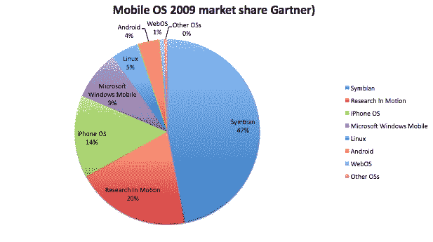

# 智能手机销量增长 24%，去年 iPhone 的份额几乎翻了一番(Gartner)

> 原文：<https://web.archive.org/web/http://techcrunch.com/2010/02/23/smartphone-iphone-sales-2009-gartner/?utm_source=feedburner&utm_medium=feed&utm_campaign=Feed:+Techcrunch+(TechCrunch>&utm_source=twitterfeed&utm_medium=twitter)

# 智能手机销量增长 24%，去年 iPhone 的份额几乎翻了一番(Gartner)

根据 Gartner 发布的最新[市场份额数据](https://web.archive.org/web/20230204232521/http://www.gartner.com/it/page.jsp?id=1306513)，去年，苹果 iPhone 的全球智能手机市场份额几乎翻了一番，达到 14.4%，比前一年增长了 6.2 个百分点。iPhone 仍然落后于诺基亚的塞班智能手机(排名第一)，其份额下降了 5.5 个百分点，至 46.9%，以及 RIM Blackberries(排名第二)，其增长了 3.3 个百分点，以 19.9%的份额结束今年。

请记住，这些是全球范围的估计。在美国，黑莓和苹果都比塞班大得多。说到移动网络流量，苹果和安卓以 81%的份额占据主导地位。根据 Gartner 的数据，Android 手机的销量跃升了 3.4 个百分点(至 3.9%)，但 Android 仍然小于 WIndows Mobile 或 Linux。然而，这些移动操作系统的市场份额分别下降了 3.1%和 2.9%。Palm 的 WebOS 仅占 0.7%的份额。

因此，当你把所有东西都算在一起时，塞班失去了最大的份额(5.5%)，其次是 Windows Mobile 和 Linux。iPhone 的涨幅最大(6.2%)，相比之下，黑莓和安卓的涨幅较小，但大致相当(分别增长 3.3%和 3.4%)。

Gartner 估计，去年总共售出了 1.72 亿部智能手机，增长了 24%。相比之下，手机总销量持平，为 12 亿部。去年，智能手机占手机总销量的 14%，高于 2008 年的 11%。iPhone 尽管有所增长，但去年仅占手机总销量的 2%。以下是来自 Gartner 的市场份额表:

**表 2** **2009 年全球智能手机终端用户操作系统销量(千部)**

| **公司** | **2009** **单位** | **2009 年
市场
份额(%)** | **2008**2008**单位** | **2008 年
市场
份额(%)** |
| 智能移动终端操作系统 | 80,878.6 | 46.9 | 72,933.5 | 52.4 |
| 动态研究 | 34,346.6 | 19.9 | 23,149.0 | 16.6 |
| iPhone OS | 24,889.8 | 14.4 | 11,417.5 | 8.2 |
| 微软 Windows Mobile | 15,027.6 | 8.7 | 16,498.1 | 11.8 |
| Linux 操作系统 | 8,126.5 | 4.7 | 10,622.4 | 7.6 |
| 安卓 | 6,798.4 | 3.9 | 640.5 | 0.5 |
| WebOS | 1,193.2 | 0.7 | 钠 | 钠 |
| 其他操作系统 | 1,112.4 | 0.6 | 4,026.9 | 2.9 |
| **总计** | **172373.1** | **100.0** | **139287.9** | **100.0** |

来源:Gartner(2010 年 2 月)

**表 1** **2009 年全球移动终端最终用户销量(千台)**

| **公司** | **2009 年** **销售额** | **2009 年
市场
份额(%)** | **2008 年** **销售额** | **2008 年
市场
份额(%)** |
| 诺基亚（总部设在芬兰） | 440,881.6 | 36.4 | 472,314.9 | 38.6 |
| 三星电子 | 235,772.0 | 19.5 | 199,324.3 | 16.3 |
| 水平规ˌ水准仪(Level Gauge) | 122,055.3 | 10.1 | 102,789.1 | 8.4 |
| 摩托罗拉 | 58,475.2 | 4.8 | 106,522.4 | 8.7 |
| 索尼爱立信 | 54,873.4 | 4.5 | 93,106.1 | 7.6 |
| 其他人 | 299,179.2 | 24.7 | 248,196.1 | 20.3 |
| **总计** | **1211236.6** | **100.0** | **1222252.9** | **100.0** |

注*此表包括 iDEN 出货量，但不包括 ODM 到 OEM 的出货量**。来源:Gartner(2010 年 2 月)**