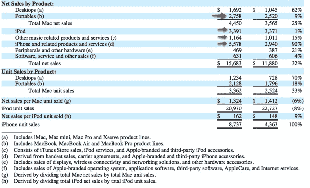
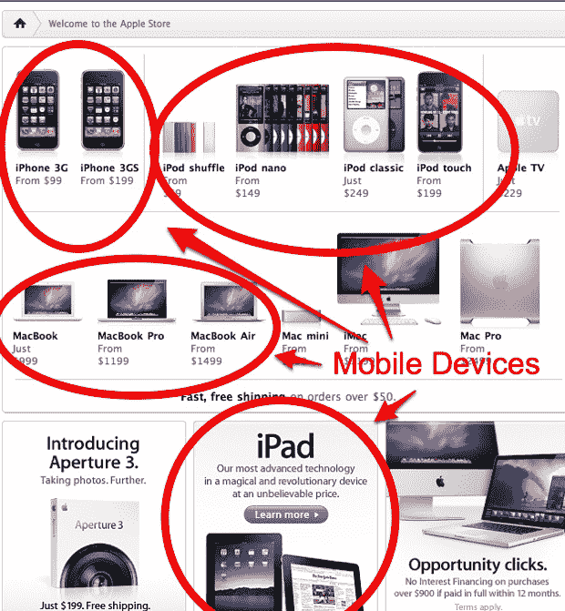

# 蒂姆·库克:苹果是“一家移动设备公司”

> 原文：<https://web.archive.org/web/https://techcrunch.com/2010/02/23/tim-cook-apple-mobile-device-company/>

# 蒂姆·库克:苹果是“一家移动设备公司”

苹果认为自己是一家移动设备公司。在一月份的 iPad 发布会上，史蒂夫·乔布斯[提到](https://web.archive.org/web/20230124234225/https://techcrunch.com/2010/01/27/apple-tablet-event/)“苹果现在是世界上最大的移动设备公司。”在今天的高盛会议上，[在华尔街日报](https://web.archive.org/web/20230124234225/http://blogs.wsj.com/digits/2010/02/23/live-blogging-apples-tim-cook-at-goldman-sachs-conference/)的博客直播中，首席运营官[蒂姆·库克](https://web.archive.org/web/20230124234225/http://www.crunchbase.com/person/tim-cook)回应了一个直接的问题:“是的，你绝对应该把苹果看做一家移动设备公司。”

库克还指出，现在苹果的大部分收入来自移动设备(包括笔记本电脑)或这些设备的内容。事实上，如果你看看苹果第四季度 157 亿美元的收入(T7)，其中近 120 亿美元来自便携式 macbook(28 亿美元)、ipod(34 亿美元)和 iphone(56 亿美元)。另外 12 亿美元来自 iTunes。

苹果没有放弃电脑。它是一家移动设备公司，因为计算正在走向移动化。Apple TV 之类的东西呢？“苹果电视是一种爱好，”库克轻蔑地说，呼应了乔布斯之前表达的另一种观点。尽管如此，该公司上个季度销售的苹果电视比前一年多了 35 %,并继续投资于这一机会。

关于库克今天所说的更多内容，请阅读《华尔街日报》的 liveblog 笔记或[商业内幕](https://web.archive.org/web/20230124234225/http://www.businessinsider.com/live-apple-coo-tim-cook-at-the-goldman-tech-conference-2010-2)。

