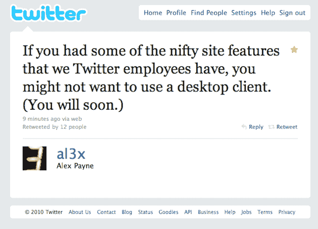

# 推特添加“漂亮”的网站功能，可能会让你忘记第三方客户

> 原文：<https://web.archive.org/web/https://techcrunch.com/2010/02/27/new-twitter-features/>

# 推特添加“漂亮”的网站功能，可能会让你忘记第三方客户

如果推特工程师亚历克斯·佩恩·T2 今天发来的推文有任何迹象的话，推特似乎即将对其网站进行一些重大改变。事实上，这些新功能可能非常好，以至于很明显，它们可能会让一些人重新审视他们对桌面推特客户端的使用。正如佩恩[所写](https://web.archive.org/web/20221208190011/http://twitter.com/al3x/status/9753956216):

> 如果你有一些我们推特员工拥有的漂亮的网站功能，你可能不会想使用桌面客户端。(您很快就会明白。)

毫不奇怪，这条推特让一些第三方推特开发者感到担忧。

”*@*[*al3x*](/web/20221208190011/https://techcrunch.com/al3x)*作为一名开发人员，我不知道该如何看待这条迫在眉睫的微博。*、“[写道](https://web.archive.org/web/20221208190011/http://twitter.com/jazzychad/status/9754044624)开发者 Chad Etzel(实际上[曾在 Twitter 兼职)。佩恩立即将](https://web.archive.org/web/20221208190011/http://groups.google.com/group/twitter-development-talk/msg/ce234cb26e180a3a?pli=1)[修改为](https://web.archive.org/web/20221208190011/http://twitter.com/al3x/status/9754318744)、*@*[*jazz Chad*](/web/20221208190011/https://techcrunch.com/jazzychad)*我并不是说开发者不能与网站竞争。当然，我们仍然会发布大多数 API 优先的东西。*”

虽然我对[和](https://web.archive.org/web/20221208190011/http://brizzly.com/)[都有所涉猎，但我仍然每天主要使用 Twitter.com，所以这些新的、更强大的功能的前景让我兴奋。我从未接触过任何一个桌面客户端的原因与我只接触 Brizzly 和 Seesmic 的原因是一样的:API 的滞后(和速率限制)让我很恼火。但是，随着新的推特数据洪流的出现，这种情况有望很快改变。](https://web.archive.org/web/20221208190011/http://seesmic.com/)

去年，推特给推特网增加了两个新功能:列表和转发。很难想象他们现在还在为这个网站做什么。一个明确的可能性是嵌入式地理定位，推特目前通过其 API 提供，但是[不在网站本身](https://web.archive.org/web/20221208190011/https://beta.techcrunch.com/2009/11/19/twitter-location-api/)上。

虽然新功能很棒，但 Twitter 必须小心不要让事情变得太复杂。Twitter 的核心一直是[它的简单性](https://web.archive.org/web/20221208190011/https://beta.techcrunch.com/2009/07/04/short-is-sweet-postcards-begat-sms-begat-twitter/)——如果你开始关注功能，那会很快消失。

尽管如此，仍有改进的余地。当然，搜索是网站上可以升级更多选项的一个领域。[即将推出的 Twitter 广告](https://web.archive.org/web/20221208190011/https://beta.techcrunch.com/2010/02/23/twitter-ads-look-like-love/)被认为是围绕 Twitter 搜索打造的，因此它很可能很快就会进行彻底改革。

值得注意的是，Twitter 最近还从 LinkedIn 聘请了一位新的 UI 大师。这个人主要负责 LinkedIn 漂亮的 iPhone(和其他移动平台)应用程序。Twitter 会不会也加入这场游戏？第三方开发者应该担心这些举动吗？Twitter 列表尤其侵犯了像 Brizzly 这样的服务正在做的事情(尽管它们现在合作得很好)。任何更多的侵犯和 Twitter 即将举行的开发者大会将会非常有趣。

**更新** : [更多](https://web.archive.org/web/20221208190011/http://twitter.com/al3x/status/9758794582)来自佩恩:

> 呃，我喜欢的员工专用测试网站上的所有东西实际上都是建立在我们已经提供给开发者的公共 API 方法上的。

[和](https://web.archive.org/web/20221208190011/http://twitter.com/al3x/status/9758849544):

> 我的意思是我们的网络客户团队正在开发很酷的东西。这将激励桌面应用开发者。同样的数据，新的视角。