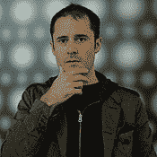

# Ev Williams: Twitter 的首要原则，“成为一股向善的力量”

> 原文：<https://web.archive.org/web/https://techcrunch.com/2010/03/15/ev-williams-sxsw/>

我们在德克萨斯奥斯丁的 [SXSW](https://web.archive.org/web/20230213025728/http://sxsw.com/) 节上，Twitter 的联合创始人[伊万·威廉姆斯](https://web.archive.org/web/20230213025728/http://www.crunchbase.com/person/evan-williams)和 Umair Haque 一起做主题演讲。威廉姆斯可能会利用这段时间谈论一下 Twitter 即将推出的广告平台。**更新**:它实际上是一个“At 平台”，在任何地方都可以调用——更多[在这里](https://web.archive.org/web/20230213025728/https://techcrunch.com/2010/03/15/twitters-new-at-anywhere-platform-allows-for-deeper-integration-into-third-party-sites/)。

有趣的是，Twitter 在三年前的这次会议上首次大受欢迎。

*下面找我的现场笔记(转述):*

呃:你今天有什么有趣的事情想说吗？

是的，我们想宣布一些事情。我们想宣布我们新的“At 平台”(毫无疑问是拼写为@ Platform)——一种将 Twitter 整合到任何网站的方式。“在任何地方”——基本上，你可以把 Twitter 悬浮卡放在任何网站上。我们推出了 13 个网站，包括亚马逊、ebay、雅虎、Digg、Bing、Meebo、Salesforce。

呃:那么你能用这个做什么呢？

EW:你可以很容易地从任何使用它的页面上发推文。此外，也许你想与帖子的作者交谈，而不是去 Twitter，你可以只停留在他们的名字上，然后发推。Twitter 是保持联系的一种非常简单的方式。

呃:所以这有助于你将信息联系起来。但是为什么网站会使用这个呢？

EW:与你以前没有的用户建立联系——这让人们不断回来。这将为一个网站带来更多的追随者。同时，希望更多你的粉丝使用 twitter 来谈论你或你的内容。你可以引入用户谈论你网站的推文。

呃:所以这是一个增强网站网络和活力的平台。但这是一个“At 平台”而不是“广告平台”。

EW:是的，这是关于降低信息的壁垒。

呃:是什么让 21 世纪的企业与众不同？比如推特？对我来说，第一个原则是实验。你为什么愿意探索不同的可能性？

EW:实验让你创造价值。"不管你一开始是怎么想的，你都错了。"我们这个时代的大多数伟大企业都进行了尝试。比如谷歌。

呃:所以这是关于创造价值，然后把它弄清楚？

EW:是的，是关于为用户和企业创造体验。如今，Twitter 有大量的商业用途——这是最大的用途之一。我们希望做得更好、更容易、更快。

呃:Twitter 正在向什么方向发展？

EW:Twitter 是什么一直是一个很难回答的问题。我们认为它是一个信息网络——不同于社交网络。这是关于获取信息和分享。你可以利用 Twitter，而不用分享你的生活。我们需要提高信噪比。

呃:所以更好的信息，更好的联系，更好的选择。

EW:是的。

呃:实验是关于迭代。那么这在 Twitter 上是如何发生的呢？

EW:我们公司现在有一群很棒的人。在过去的一年里，我们发展非常迅速。我们的员工增长曲线几乎和我们现在的用户增长曲线一样。我们有专注团队的人，比如移动或国际化团队。我们担心集中思考和缓慢的过程。所以我们告诉我们的团队“努力去做”

呃:那么你的角色是什么？

EW:我不会深入代码的具体细节，因为事情会变得一团糟。我大部分时间都在思考高层次的问题。我对公司想了很多——我们如何扩大公司规模，我们的文化等等。我们如何定义我们想要的特征。我认为服务和公司之间有相似之处——开放是巨大的，透明的。

呃:所以开放非常重要。帮助我们追踪 Twitter 的开放弧线。

EW:是的，这意味着很多事情。我们争论是公开还是透明。"窗户是透明的，但门是开着的."用户已经把 Twitter 变成了他们想要的样子。现在开发商也在做同样的事情。开放真的是一种生存技巧。

当新员工开始工作时，我会坐下来和他们一起讨论你在 Twitter 工作时应该有的 9 个假设。一个关键是假设公司外部的聪明人比内部的聪明人多。

呃:把金鹅送人怎么样？为什么这么开放？

EW:对我们来说这是一个大问题——与必应和谷歌的交易。这些是第一批和我们分享完整视频流的人。关于这一点有很多争论。因为我们还没有商业模式，所以为什么要放弃呢？但是我们回到了给用户最大价值的原则。

每天有 5000 万条推文，我们如何向你展示最适合你的推文？现在，我们在这方面做得还不够好。但是有了这些伙伴关系，我们有更多的机会做到这一点。

呃:内部对此有很多争论吗？

EW:是的，有很多。但我们认为这很好。现在我们已经扩大了交易范围——比如与雅虎的交易。几周前，我们讨论过将这些数据提供给成千上万的其他人。

现在第三方开发者正在创造大量的价值。比如在推特上加图片。

CoTweet 和 HootSuite 也很有趣。Twitter.com 不是一个做客户支持的好界面，但是那些家伙是。CoTweet 刚刚被一家公司收购，该公司希望更多地关注这一点。

我们希望看到更多关注创造这些创造价值的深刻体验。

呃:所以实验和开放。其他公司想要控制权，比如苹果。你们有多开放？

EW:我们相当开放——我们需要使用一些控制，因为如果我们无限开放，我们会对用户造成伤害。开放仍然会对你不利。必须要多多管理。拥有一个开放的 API 使得制作向用户发送垃圾信息的应用变得更加容易。我们每天都向制作垃圾邮件工具的公司发送停止和终止信息。我们必须施加一些控制。

呃:我认为牧羊是一个很好的说法。所以你最近有了一些有趣的用途——比如智利的地震。

EW:我最近收到了一封关于地震的电子邮件，感谢我们在这种情况下的帮助。这对我们来说非常令人满意，因为我们一直认为让 Twitter 接收到世界上最弱的信号非常重要。我们一开始非常重视短信，而且它对我们来说仍然非常重要。因为它影响了很多人。我们与全球 65 家运营商达成协议，发送这些短信推文。

我们才刚刚开始。我们在印度看到了非常强劲的增长，那里的手机短信数量巨大。在中东。

呃:我认为这种改变世界的东西是企业家的未来。它触及了包容性的核心问题。那么，什么是“活跃用户”？

EW:对我来说，这又回到了——有人从 Twitter 中获得价值了吗？如果他们没有账户，就很难知道，就像那些在谷歌上搜索推文的人。开始时，我们花了很多精力告诉世界或你的朋友和家人你在做什么。但现在 Twitter 上有了一些有趣的东西——就像 Twitter 上的烈焰红唇一样，你可以获得乐队的更新。

随着越来越多的人开始在 Twitter 上获取信息，他们更有可能参与进来。

呃:有人已经开始在白宫内部使用 Twitter 了，对吗？

EW:是的，这真的很有趣，它来自白宫。这是一个官方渠道，但他们用的是另一种方式。这是关于减少有很大影响力的人和他们影响的人之间的隔阂。这是互联网最深远的承诺。这是我 10 年前开始写博客时掀起的浪潮。这是关于信息的民主。任何人都可以把信息放到网上——这是巨大的。

呃:英国的推特部长汇总了议会成员的推特信息。从某种程度上来说，这是在重塑社会。但我们也有一种反作用力——比如国家对信息的控制。

EW:在某些地区，是的，这是不好的，对网络有害。但是互联网是一股浪潮，你将无法置身事外。就像在中国，谁知道这些防火墙能支撑多久——但不会永远。

呃:是的，已经有很多方法可以穿过防火墙了。他们压力很大。

让我们来谈谈“更好”我预定了去他在异国他乡的五星级度假村的旅行。当我到那里时，那是一间小屋。经理什么也做不了——所以我把它放到了推特上。15 分钟内，预订公司给我打了电话，20 分钟后，我找到了一家新酒店。半小时后，我的假期就确定了。

EW:太棒了。我们希望这是常态，而不是侥幸。我们有一点二分法，因为你想寻找更多的日常生活。我们不只是想最大化这一点，我们希望让 Twitter 对你更有用。我们希望减少你花在 Twitter 上的时间，而不是增加。

最近，我们经历了一个过程，以确定我们的经营原则。首要原则是“成为一股向善的力量”另一个原则是“注意”

大卫·波格发起了一场反对运营商隐性收费的运动。我和酒店经营者也是一样。我知道你是沃伦·巴菲特的忠实粉丝，他也相信创造真正的价值。

EW:是的，从商业角度来看，Twitter 需要从根本上帮助人们做出更好的决定。或者帮助一些通常不会发生的事情发生。比如通过短信向海地捐款——我们没有拿钱，但它通过 Twitter 像病毒一样传播开来。人们想要互相帮助，我们需要减少摩擦。

呃:这是你想在新的 at 平台上做的吗？

EW:是的，完全正确。我们会看到会发生什么，明显的东西是更多的推文，但我认为这也是摩擦的降低。

呃:你问自己，我怎样才能让沃尔玛变得更好？为什么要问自己这个？

EW:因为当我们看到企业如何使用 Twitter 时，我们希望我们的工具能帮助企业变得更好。

世界往往是一个没有交流的黑匣子。缺乏对话和透明度。所有这些技术的承诺是，这种情况会消失。你就结束了这个循环。

呃:给我们概述一下你的大目标。

EW:促进信息的公开交流。成为一股向善的力量。信息交流的便利很重要。用一些像转发这样的小事来帮助别人。这是我们的抱负。

呃:谷歌就是要把全世界的信息归档。你的不同——创造新的信息。

不过，这都是关于优势的——你的优势是什么？

EW:只有大家都赢了，我们的优势才会出现。我们只做双赢的交易。因为任何有损失的交易都是不可持续的。**这就是为什么我们还没有增加收入——有很多唾手可得的果实，但没有一个是可持续的**。

为他人创造优势，而不是给他们一个围着你转的理由——这是关键。

呃:互联网正在成为一个更好的媒体产业吗？

EW:我认为正在发生巨大的转变——但这是一个涉及一切的生态系统。这种用户生成的内容只是让事情变得更丰富。博客和传统媒体一起工作。Twitter 赞美传统媒体。昨晚我和 CNN 的一些人聊了聊——这帮助他们改变了他们的工作。这是双赢。

呃:At 平台将如何处理这个问题？

EW:希望这些人会用它来发布新消息。

呃:是什么让你滴答作响？

EW:有两种类型的企业家。驱动我的是创造以前不存在的东西。你的产品或服务应该在句子的最后:“如果……不是很棒吗？”

这是创造新的东西，而不是从旧的东西中提取。有些人视金钱为目标，而不是团队。我创建企业来制造新事物。它是创造世界上更多事物的燃料。我很幸运地偶然发现了一些有助于改变世界的东西。

呃:为什么要关注这些事情呢？

EW:很大程度上是运气。但也许这才是我感兴趣的。Twitter 是 Odeo 的一个副业项目——是我的共同创始人想出来的。博客一度也是一个副业。

呃:如果某个东西很棒，人们就会使用它。

EW:是的。

此外，帮助他人成功是我们的一个次级原则。

呃:再给我们讲一两个吧。

EW:成为一股向善的力量，注意——让事情发生是另一回事。还有建立信任的文化。

呃:你对其他企业家有什么重要的启示？

EW:创造一些你想在世界上存在的东西。另一个是专注。许多人在应该做一件事的时候却在试图做很多事。无论你在尝试什么，你都可能是错的，但你会尝试其他事情。

许多伟大的公司现在都来自硅谷之外。你不必去那里。

*这是一个总结。*