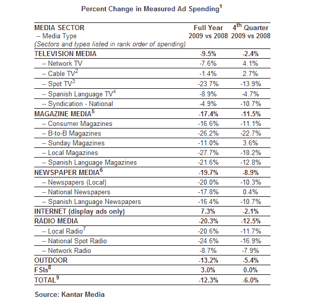

# 2009 年，广告支出下降了 12.3%，但数字广告增长了 7.3%

> 原文：<https://web.archive.org/web/https://techcrunch.com/2010/03/17/advertising-expenditures-2009/>

# 2009 年，广告支出下降了 12.3%，但数字广告增长了 7.3%

根据 [Kantar Media](https://web.archive.org/web/20221006232702/http://www.kantarmediana.com/) 今天发布的数据[显示，与 2008 年相比，去年的广告总支出下降了 12.3%，至 1253 亿美元。然而，2009 年第四季度的广告支出比去年同期下降了 6%，几乎所有媒体都比 1-9 月的表现有所改善。](https://web.archive.org/web/20221006232702/http://www.businesswire.com/portal/site/home/permalink/?ndmViewId=news_view&newsId=20100317005458&newsLang=en)

放大等式的数字部分，Kantar Media 表示，2009 年互联网显示广告支出实际增长了 7.3%，这得益于电信、工厂汽车和旅游类别的支出增加。

不出所料，印刷媒体受到重创，2009 年报纸行业的广告支出下降了 19.7%。

你可以在[的新闻稿](https://web.archive.org/web/20221006232702/http://www.businesswire.com/portal/site/home/permalink/?ndmViewId=news_view&newsId=20100317005458&newsLang=en)中找到更多的数字和见解。

