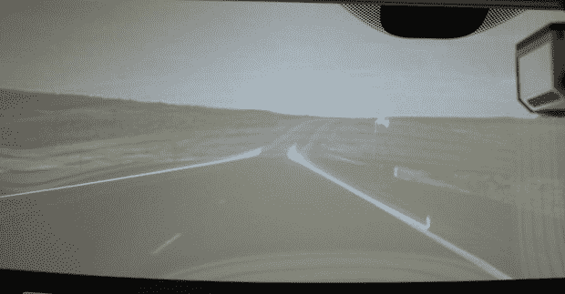

# 通用汽车的增强视觉系统为车辆 hud 带来了增强现实

> 原文：<https://web.archive.org/web/https://techcrunch.com/2010/03/17/gms-enhanced-vision-system-brings-augmented-reality-to-vehicle-huds/>

# 通用汽车的增强视觉系统为车辆 hud 带来了增强现实

 
平视显示器早就不是新的了。自 80 年代末以来，它们就出现在通用汽车中，它们已经从仅仅显示速度表，发展到夜视，并很快由于激光，相机和导航而发展到增强现实。

[增强视觉系统](https://web.archive.org/web/20230406060245/http://media.gm.com/content/media/us/en/news/news_detail.brand_gm.html/content/Pages/news/us/en/2010/Mar/0317_hud)的设计与之前的实施一样，都考虑到了安全性，但却将其提升到了一个全新的水平。假设有雾或暴风雨。紫外激光将在挡风玻璃上画出道路线，甚至可以阅读路边的标志来帮助导航。增强的夜视模式甚至可以与新系统配合使用，更准确地识别道路障碍物和动物。

所有这些都是通过一系列前置传感器完成的。这与几个跟踪驾驶员头部和眼睛的车载摄像头相结合，以正确地将增强现实层放置在挡风玻璃上。

虽然通用汽车显然在该系统上投入了大量时间和精力，但该公司尚未宣布是否和/或何时将推出汽车。
【YouTube http://www.youtube.com/watch?v=e10uYuSiz9Y&HL = en _ US&fs = 1&]