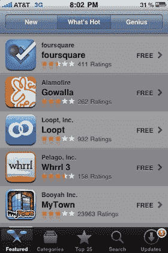
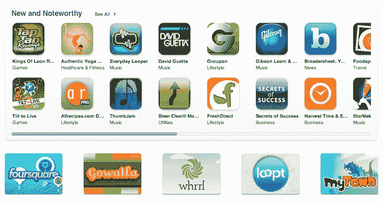

# 苹果在应用商店 TechCrunch 也掀起了定位热

> 原文：<https://web.archive.org/web/https://techcrunch.com/2010/03/17/location-apps-app-store-apple/>

# 苹果在 App Store 中也掀起了定位热

 SXSW 互动现在结束。虽然“位置战”的明显赢家尚未确定，但事实是许多基于位置的服务赢了，因为[它们都在过去一周获得了大量曝光](https://web.archive.org/web/20221206221358/https://beta.techcrunch.com/2010/02/25/location-sxsw/)。并期待这一趋势继续大规模发展，因为苹果现在在 App Store 中突出了其中的几个。

正如你在这篇文章的图片中所看到的，苹果在 iTunes 的应用商店和 iPhone 的应用商店中都突出了五个关键位置。在 iTunes 版本中，应用程序在“新的和值得关注的”区域下方有自己的区域。在 iPhone 上，这五个应用占据了“热门内容”区域的前五名。简单来说:这个提升是巨大的。

那么这五个 app 是什么呢？这些名字对你来说应该很熟悉，因为我们最近已经讨论过了。Foursquare ( [我们的覆盖范围](https://web.archive.org/web/20221206221358/http://www.crunchbase.com/company/foursquare/posts))、Gowalla ( [我们的覆盖范围](https://web.archive.org/web/20221206221358/http://www.crunchbase.com/product/gowalla/posts))、Loopt ( [我们的覆盖范围](https://web.archive.org/web/20221206221358/http://www.crunchbase.com/company/loopt/posts))、Whrrl 3 ( [我们的覆盖范围](https://web.archive.org/web/20221206221358/http://www.crunchbase.com/product/whrrl/posts))和 MyTown ( [我们的覆盖范围](https://web.archive.org/web/20221206221358/http://www.crunchbase.com/company/booyah/posts))。我认为苹果是在阅读了 TechCrunch 后选择了这些人，但谁知道这家神秘公司的背后发生了什么。

正如任何一个应用开发者会告诉你的那样，让你的应用具有特色可以成就它，也可以毁掉它。即使是最受关注的两家公司，Foursquare 和 Gowalla(最近位置大战中的两个关键角色)，也将受益于苹果通过 App Store 接触各种不同受众的能力。Foursquare 早些时候宣布，仅在过去 10 天内,[就增加了 100，000 名新用户,](https://web.archive.org/web/20221206221358/http://twitter.com/foursquare/status/10640335152)——只要苹果继续推出这款应用，这种增长可能会持续下去。

其他三家公司都曾受益于苹果之前的促销活动。值得注意的是，这帮助 [MyTown 在推出后不到一个月的时间里在规模上超过了 Foursquare 和 Gowalla。](https://web.archive.org/web/20221206221358/https://beta.techcrunch.com/2010/01/14/mytown-booyah-location-iphone/)

苹果公司称游戏开始。

