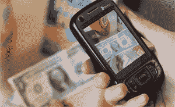

# LookTel，一款盲人应用 TechCrunch

> 原文：<https://web.archive.org/web/https://techcrunch.com/2010/03/23/looktel-an-app-for-the-blind/?utm_source=feedburner&utm_medium=feed&utm_campaign=Feed%3A+Techcrunch+%28TechCrunch%29>

# LookTel，一款专为盲人设计的应用

 
这是阴天的一缕阳光。 [LookTel](https://web.archive.org/web/20221207175433/http://www.looktel.com/) 是一个对象标识符——你把它指向某个东西，它会告诉你那是什么。你可以教它识别新的物体，通过瞄准一个产品，程序可以使用真实的语音告诉它是什么，当你需要在飞行中识别某些东西时，你可以贴上一个图像标签并阅读标签。它或多或少是一个条形码和 QR 扫描仪，带有一些图像识别功能，但它真的可以成为视力下降或下降的人的福音。

该系统需要比普通智能手机多一点的计算能力，所以你需要一台本地电脑来帮助识别一些东西。机器学习是这样工作的:

> 运行 LookTel Mobile 软件的用户使用手机的触摸屏界面进行导航，使用手机的摄像头识别物体。LookTel Mobile 软件可以在兼容的 Windows Mobile 智能手机上运行。LookTel Mobile 软件将现场图像从手机传输到运行 LookTel 基站的 PC，这是我们复杂的识别软件。当 PC 收到查找图像的请求时，它会对图像库进行排序，以找到存储在数据库中的匹配图像。然后它发回信息，允许智能手机向你朗读商品的描述。
> 
> LookTel 通过存储智能手机拍摄的物品图像，并将其与标签进行匹配，来“学习”识别新物品。标签可以是你自己的声音，也可以是由文本到语音转换引擎读取的文本标签，类似于你的家用电脑可以做的事情。

【YouTube http://www.youtube.com/watch?v=Lf-0Dj95SgY&hl=en_US&fs=1&]

还有一个现场助手部分，当你将手机摄像头对准场景时，人类可以告诉你周围发生了什么。它适用于 Windows 智能手机和 mid。

目前还没有定价——我给公司发了一封电子邮件——但我看起来是个好主意。考虑到我的眼睛可能最终会离开这些显示器，我可能需要它。