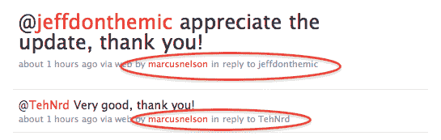

# Twitter 开始推出贡献者功能，Salesforce 激活| TechCrunch

> 原文：<https://web.archive.org/web/https://techcrunch.com/2010/03/23/twitter-contributors-salesforce/>

# Twitter 开始推出贡献者功能，Salesforce 已激活

早在 12 月，Twitter 提到了它正在测试的一个新功能，[贡献者](https://web.archive.org/web/20230317114542/http://blog.twitter.com/2009/12/feature-test-with-businesses.html)。基本上，这允许多人从一个帐户发推文(推文下面有个人归属)。Twitter 注意到这个功能还没有准备好在黄金时间推出，但是他们已经开始在他们的 [@twitter](https://web.archive.org/web/20230317114542/http://twitter.com/twitter) 账户上使用它了。如今，这项服务已经开始向其他人推广。

大约一小时前, [Salesforce 账户](https://web.archive.org/web/20230317114542/http://twitter.com/salesforce)开启了该功能。如你所见，他们已经在用了。

贡献者被认为是 Twitter 向企业提供优质功能计划的一部分。虽然他们显然还没有为此收费，但可以想象当他们的业务工具准备就绪时，这将被打包到其中。