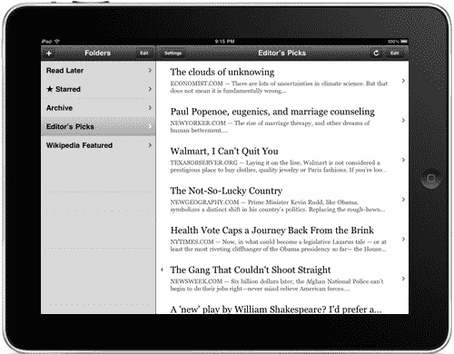

# iPad 版 Instapaper 可能是第一款黑仔应用。它将是普遍的。TechCrunch

> 原文：<https://web.archive.org/web/https://techcrunch.com/2010/03/24/instapaper-ipad/?utm_source=feedburner&utm_medium=feed&utm_campaign=Feed%3A+Techcrunch+%28TechCrunch%29>

# iPad 版 Instapaper 可能是第一款黑仔应用。它将是普遍的。

Tumblr 开发者 [Marco Arment](https://web.archive.org/web/20221006074527/http://www.crunchbase.com/person/marco-arment) 开发的简单书签应用 [Instapaper](https://web.archive.org/web/20221006074527/http://instapaper.com/) 是我最喜欢的应用之一。在[网络](https://web.archive.org/web/20221006074527/https://beta.techcrunch.com/2009/06/22/instapaper-gets-folders-and-goes-social/)、iPhone、[和 Kindle](https://web.archive.org/web/20221006074527/https://beta.techcrunch.com/2010/01/21/apple-tablet-kindle/) 之间，它无疑是我最常用的应用之一。我毫不怀疑，第四类产品即将加入这个名单:iPad。

今晚，Arment [发布了 iPad 版 Instapaper 的预览](https://web.archive.org/web/20221006074527/http://blog.instapaper.com/post/469281634)，它听起来非常适合这款设备。从美学角度来看，它看起来与 iPhone 的 Instapaper 没有什么不同。但正如阿门特解释的那样，他经历了相当多的麻烦来为新设备定制它。一个全新的功能是一个列表屏幕，当 iPad 水平放置时，你可以方便地浏览书签文章。

那么，为什么不让用户升级当前 iPhone 版本的应用程序呢？因为它看起来很糟糕，据阿门特说。事实上，他说，看到他的应用程序以这种方式放大(2 倍)的经历让他打消了使用任何放大到 iPad 分辨率的*应用程序的念头。Arment 是基于他对 iPad 软件模拟器的体验(因为还没有开发者拥有真正的设备)，但我可以确认，当我在苹果 1 月份发布后玩设备时，一些应用程序在放大时看起来确实有点不稳定。*

为了适应 iPad，Arment 重新设计了 Instapaper 的最新版本(2.2)，现在已经开发出了该应用的“通用”版本。虽然 iPhone 和 iPad 版本显然会有所不同，但显然开发者将能够在一个包中捆绑 iPhone/iPod touch 版本和 iPad 版本(SDK 页面提示)。这很有趣，因为它允许开发者为两个不同的版本收取一笔费用。我想知道是否会有更多的开发商提供类似的交易。如果 Arment 对 iPad 的升级如此不满，显然其他人也会如此，并且也渴望拥有他们的应用程序的 iPad 原生版本。但是告诉付费客户他们必须付两次钱有点牵强，所以这种通用的方法看起来很聪明。它唤起了人们对苹果从旧的 PowerPC 芯片过渡到新的英特尔芯片时存在的[通用应用](https://web.archive.org/web/20221006074527/http://www.apple.com/universal/)的记忆。

通过 iBooks 和所有的印刷媒体交易，显然苹果认为 iPad 的核心优势之一将是阅读。这就是为什么我认为 Instapaper 可能是该设备的首批真正的杀手级应用之一。Instapaper 从网络上获取任何内容，并将其剥离为最基本的阅读内容。在网上找到一段较长的内容，点击 Instapaper bookmarklet，然后在 iPhone 或 Kindle 上以精简的形式修改内容，这是一件轻而易举的事情。在 iPad 上，有了这个重新制作的应用程序，体验看起来会更好。

