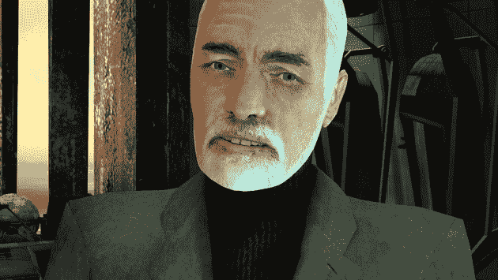

# 曾出演《半条命 2》的布林博士的配音演员去世了

> 原文：<https://web.archive.org/web/https://techcrunch.com/2010/03/25/voice-actor-who-played-half-life-2s-dr-breen-has-passed-away/>

# 在《半条命 2》中扮演布林博士的配音演员已经去世

还记得去年名人死亡事件吗？这件事对我的影响超过了所有这些事的总和。扮演[华莱士·布林博士](https://web.archive.org/web/20230323233837/http://half-life.wikia.com/wiki/Wallace_Breen)、*半条命 2* 成名[的配音演员已经去世](https://web.archive.org/web/20230323233837/http://edition.cnn.com/2010/SHOWBIZ/Movies/03/24/obit.robert.culp/index.html)。悲伤的消息是悲伤的。

罗伯特·考普在落杉矶一个不知名的公园坠楼身亡。他 79 岁了。

当你穿越 17 号城市的时候，他除了让你毛骨悚然之外，还做了其他的事情。你知道他在 20 世纪 60 年代和比尔·科斯比一起出演了一部名为《我是间谍》的电视剧吗？我当然不知道那件事。他还在《人人都爱雷蒙德》中扮演了雷·罗马诺的岳父

但对我们游戏玩家来说，是的，他将永远被称为布林博士，地球管理员，他试图说服我们抵制联合是徒劳的。

【YouTube http://www.youtube.com/watch?v=TM4Y4ZSCUtw&hl=en_US&fs=1&]

你们可能想看看这个月的《边缘杂志》,因为它有一个非常棒的专题，和 Valve 谈论他们是如何把*半衰期 2* 做得如此之好的。事实上，我一直在回放最近的游戏——非常疯狂的是，一个五岁的 FPS 从未被超越。