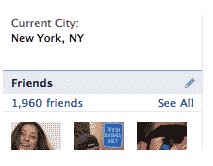
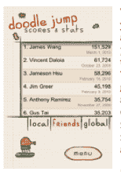

# 如何让脸书、联邦快递和亚马逊变得更有趣

> 原文：<https://web.archive.org/web/https://techcrunch.com/2010/03/27/facebook-fedex-amazon-fun/>

 * **编者按**:一切都应该是游戏吗？在这篇客座博文中，[盖布·兹彻曼](https://web.archive.org/web/20230404234546/http://www.crunchbase.com/person/gabe-zichermann)认为乐趣是好的，游戏机制将会在各种产品和业务中找到自己的路。齐赫曼是专业移动社交网络初创公司 [beamME](https://web.archive.org/web/20230404234546/http://rmbrme.com/beamme) 的首席执行官，也是即将出版的书籍[《基于游戏的营销》](https://web.archive.org/web/20230404234546/http://www.amazon.com/Game-Based-Marketing-Customer-Challenges-Contests/dp/0470562234)和[《Funware in Action》的合著者。](https://web.archive.org/web/20230404234546/http://www.manning.com/zichermann/)*

如果我们做的一切都更有趣呢？

自从 Foursquare 凭借其聪明的徽章和简化的“市长”成就闯入舞台以来，人们就一直对游戏机制着迷(当然还有 gaga 视频)。它的竞争对手和盟友，从 [Gowalla](https://web.archive.org/web/20230404234546/http://gowalla.com/) 和 [Yelp](https://web.archive.org/web/20230404234546/http://www.yelp.com/) 到 Miso、[烫手山芋](https://web.archive.org/web/20230404234546/http://hotpotato.com/)和我自己的初创公司 [beamME](https://web.archive.org/web/20230404234546/http://rmbrme.com/beamme) ，一直在宣扬积分、徽章、等级、挑战、排行榜和成就的价值，以此作为让消费者参与产品或服务的简单而强大的方式。

这种游戏机制在游戏之外的应用——也被称为[Funware](https://web.archive.org/web/20230404234546/http://funwareblog.com/)——正在席卷社交网络和移动应用世界。几乎每一个有抱负的初创公司——以及许多知名品牌，包括 Chase、NBC 和美国陆军——都在转向 Funware，以交付传统/社交营销根本无法交付的成果。正如我在新书《基于游戏的营销》中解释的那样，游戏机制可以让任何服务或社区变得更有趣；当在两个相似的活动中做出选择时，消费者总是会选择更令人愉快的一个。

你不会吗？

在未来 10 年内，几乎每一次消费者互动都将内置游戏机制。你会因为提前报税而获得积分，因为做公共服务而获得虚拟徽章，甚至会有电视游戏节目提供纯粹的虚拟奖励。是的，我正式预测“你比一个五年级的 Farmville 玩家聪明吗？”(将于 2015 年秋季在 NBC 播出)

但是游戏机制的使用并不局限于那些已经看起来有些令人愉快的事情。我总是被问及同样的问题，如何将游戏机制应用于特定的、具有挑战性的产品类别，甚至如何让伟大的产品变得更好。

因此，本着娱乐的精神，我列出了我希望看到“游戏化”的前三个网络/移动应用，以及它们应该使用的三个主要游戏机制:排行榜、积分和状态。

**脸书。**是的，它是世界上最受欢迎的社交网络，[也许是](https://web.archive.org/web/20230404234546/https://techcrunch.com/2010/03/15/hitwise-says-facebook-most-popular-u-s-site/)美国访问量最大的网站，但它仍然可以变得更有趣。

让我们以你的“朋友分数”为例。我们中的大多数人都知道自己有多少朋友，并对那些有着惊人数量联系的朋友和那些几乎不在网站上社交的朋友进行连续记录。(脸书表示，普通用户大约有 200 个朋友)。实际上，我们在脑海中保留了一个排行榜，显示我们的社交图是如何按受欢迎程度排名的。但是为什么不把排行榜公开呢？想想 Orkut 的存在几乎完全是因为这一附带特征(逐国排行榜是让数百万巴西民族主义者注册“击败”美国的原因)。

社会化排行榜可以让你更容易地衡量你的社交图的受欢迎程度，并激励你建立/增加更多的服务联系。也许分数可以加权以奖励在网站上更活跃的朋友，或者比其他人有更多联系的朋友。一个设计良好的董事会也可以让你看到你的相对和绝对排名，以及一个简单的邀请做得更好一点(“增加两个朋友，以击败山姆的分数”)。它甚至可以通过对你的行为评分来奖励你有更多的朋友。

产生这种行为将是一个巨大的双赢。拥有更多朋友通常意味着个人对脸书和现实生活更满意，而脸书经常称联系的数量是用户增长和参与的最重要驱动力。通过排行榜的简单力量，所有这些都是可能的，并将进一步巩固脸书内在的娱乐潜力。

联邦快递。随着电子商务和简化物流的兴起，商家和消费者越来越熟悉如何将包裹运送到全国和世界各地。毕竟，简化运输(比如亚马逊的免费超级省钱妙招)被认为是电子商务增长最重要的驱动力之一。但是为什么运送(或接收包裹)的体验不能变得更加有趣和社交化呢？

如果联邦快递允许你将你的社交图与你的货物联系起来，让你在游戏板上看到你的途中包裹，而不是你的朋友，会怎么样？您将收到各种运输统计数据的分数和排名，比如总运输时间、每天行驶的英里数等等。你可以和通过地面(或 USPS)发送包裹的朋友“说点什么”,甚至选择使用积分来加快已经在进行的运输。你甚至可以设计它来奖励“绿色”选择，作为第二层次的互动。简而言之，这款游戏将有一个内在的激励机制，让用户选择更快的运输方式，并宣传他们对承运商的选择。

如果他们想更上一层楼，他们甚至可以整合来自竞争对手的跟踪流数据(看看 UPS 有多慢！)并让消费者利用人类智慧的力量来做仓库到目的地的路线演算，这是一个超级复杂的数学问题，可以很容易地制作成一个有趣的游戏。突然间，航运不仅仅是一种商品，而是一种享受，而且完全可以用积分来实现。

**Amazon.com 书评。**保罗·卡尔最近写了一篇[热情洋溢的文章](https://web.archive.org/web/20230404234546/https://techcrunch.com/2010/03/22/im-not-kidding-do-it-now/)，讲述亚马逊的书评未能适应消费者警戒主义。虽然评论很有趣，建议也很清晰，但让亚马逊(或 Yelp，或猫途鹰)的产品和服务评论更加准确和相关，可以通过深思熟虑的 Funware 应用程序来更好地完成，而不是一次性的规则制定。

事实上，亚马逊的评论计划是第一个非常成功的声誉系统之一，使用基本的徽章机制和“标记”来鼓励和奖励彻底的评论。尽管早期领先，但该网站的评论系统在过去几年中停滞不前，无关的徽章成为常态(“前 500 名评论者”)，与社交图没有真正的联系。

通过借鉴《Farmville》和其他脸书游戏，亚马逊可以重燃在网站上写评论的乐趣，并大大有助于消除阻碍作品的干扰。关键是以朋友和潜在买家都能看到的方式将评论与社交图关联起来。

我首先会为每本购买的书创建一个虚拟书架——无论是在 Kindle 上还是在现实世界中——让人们可以将它与脸书连接起来，并管理内容。现在从 [Blippy](https://web.archive.org/web/20230404234546/http://blippy.com/) 和 Farmville 中抽取一页，并在每次购买时发布:

加布刚刚在 Amazon.com 购买了基于游戏的营销，看看他的书架。

这将推动朋友们访问 Gabe 的虚拟书架，为亚马逊提供一种有趣的方式来社交化图书(或其他产品)购买，同时确保原始买家的朋友正在阅读他们的评论(这在今天很少发生)。然后，为购买、阅读、评论和布道行为发放可视化的社会化徽章，以便用户的状态与他们在虚拟书架上的书籍以及他们对这些书籍的评论直接相关。

因为我们也知道徽章在创造积极的状态循环和令人满意的行为方面非常有效，亚马逊可以很容易地为广泛的阅读活动发放徽章。无论是科幻小说《发现》还是阅读 20%的关于巴拉克·奥巴马的畅销书，鉴于文学的范围，几乎有无限数量的徽章可以获得！

现在，允许随机购买者直接从亚马逊上的产品页面浏览 Gabe 的虚拟书架(或虚拟客厅、厨房、花园)。这将有助于读者/买家更好地理解书评(我个人对书评最大的抱怨是，我不能根据自己的品味来判断书评人的品味)，并让书评人更加诚实，因为他们的真实社交图谱与他们选择保存/管理的书籍相关联。

简而言之，亚马逊可以通过利用社交媒体宣传的选择和徽章，让图书的发现、购买和评论变得更加有趣。

无论是脸书、联邦快递、亚马逊还是你自己的创业公司，娱乐软件和游戏机制都会对客户之间以及客户与你的产品之间的互动产生深远的影响。整合积分、徽章、等级、挑战、排行榜和成就是推动消费者参与的直接方式，即使潜在活动本身并不令人愉快。这是我们一次又一次学到的一课——如果一个游戏机制足够好，用户就不会在乎主题是否平庸(Farmville)或活动是否重复(four square)；他们关心的只是出色完成虚拟工作的虚拟回报。

在我们快乐的未来，我们将为我们所做的一切赢得这些虚拟的、社会的奖励——从运送包裹到倒垃圾，从取得好成绩到买书。如果早期 Funware 应用程序的快速成功有任何迹象，也许一个更有趣的世界比我们想象的更近。