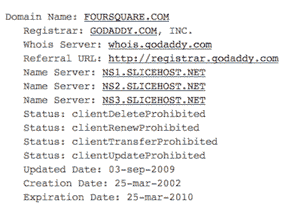
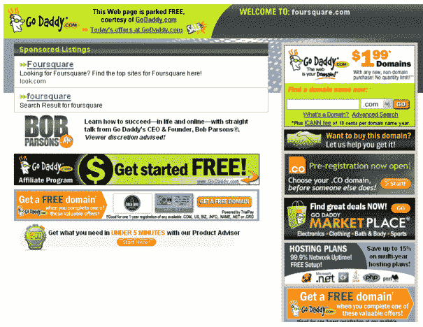

# Foursquare 也变暗了。无意中。TechCrunch

> 原文：<https://web.archive.org/web/https://techcrunch.com/2010/03/27/foursquare-offline/>

# Foursquare 也变暗了。无意中。

早些时候，我们[取笑 Bing](https://web.archive.org/web/20230225045815/https://techcrunch.com/2010/03/27/turn-your-lights-off-bing-needs-extra-power-today/) 今天用一种根本不节能的方式“黑暗”节能。但是 Foursquare 有一个实际的方法来做到这一点:关闭整个服务。

昨天， [Foursquare](https://web.archive.org/web/20230225045815/http://foursquare.com/) 出现了一些宕机。这并不新鲜，创业公司总是有停机时间——看:Twitter，这是他们大约一年的惯用手法——但 Foursquare 的原因似乎有点幽默。

虽然网站现在已经恢复运行，但 Foursquare 似乎忘记了更新他们的域名，该域名已于 3 月 25 日到期。因此，注册服务商 GoDaddy 关闭了该网站，并建立了自己的登录页面。有些人[在推特上注意到了](https://web.archive.org/web/20230225045815/http://twitter.com/realsamengland/statuses/11088193191)和其他人向我们透露的消息。

对 Foursquare 来说幸运的是，像 GoDaddy 这样的注册商往往会在撤销你的域名并将其重新出售之前给你几个通知。看起来 Foursquare 能够很快抓住它，并让它回到那里。尽管如此，这似乎是一家公司[的一个相当大的疏忽，据称该公司正在筹集新一轮 1000 万美元的资金](https://web.archive.org/web/20230225045815/https://techcrunch.com/2010/03/25/four-vc-firms-battle-for-foursquare-valuation-goes-stratospheric/)，这将使其账面估值接近 8000 万美元。

让我们期待一些钱流向一个新的职位:领域的主人。

有趣的是，在第一轮融资后，Foursquare 做的第一件事就是购买 foursquare.com 域名。以前，这项服务是在 playfoursquare.com 发现的。因此，这里发生的事情可能是团队忘记了将最初拥有该域名的人的电子邮件通知更改为他们的一个电子邮件地址。至少，我希望事情就是这样。

同样值得注意的是:联合创始人 Dennis Crowley 最初想将他的第一家初创公司命名为 Foursquare，但无法获得域名，所以他选择了 Dodgeball(后来[将其出售给了谷歌](https://web.archive.org/web/20230225045815/https://techcrunch.com/2006/10/18/dodgeballcom-officially-googled/))。你会认为克劳力至少会更珍惜这个领域。

*【感谢*