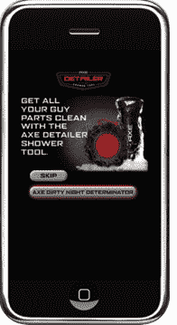

# 移动广告网络 Greystripe 将其 iFlash 广告引入 iPad TechCrunch

> 原文：<https://web.archive.org/web/https://techcrunch.com/2010/03/30/mobile-advertising-network-greystripe-brings-its-iflash-ads-to-the-ipad/>

# 移动广告网络 Greystripe 将其 iFlash 广告引入 iPad

虽然 iPad 显然[没有 Flash，](https://web.archive.org/web/20221205161435/https://beta.techcrunch.com/2010/01/27/apple-ipad-flash/)但这并不意味着富媒体不能在设备上运行。昨天，我们听说 [Brightcove 将在 HTML5 视频播放器中播放](https://web.archive.org/web/20221205161435/https://beta.techcrunch.com/2010/03/28/ipad-brightcove-videos-html5/)视频，而不是 Flash 单元。今天， [Greystripe](https://web.archive.org/web/20221205161435/http://www.crunchbase.com/company/greystripe) 宣布将于 5 月将其[富媒体 iFlash 广告单元](https://web.archive.org/web/20221205161435/http://www.greystripe.com/?release=pr44iab)引入 iPad。

Greystripe 允许广告商在他们的 iPhone 广告中使用类似 Flash 的技术已经有一段时间了。该网络基本上采用 Flash 制作的广告，并对其进行代码转换，以便在 iPhone 和现在的 iPad 上运行。该技术改变了前端 Flash 广告的性质，但富媒体广告的行为方式相同。Greystripe 声称，其“iFlash”广告的点击率甚至高于在线广告，平均点击率超过 1%。Greystripe 表示，它的 iFlash 移动广告提高了品牌的知名度以及购买、观看或推荐特定品牌的意愿。使用 Greystripe 移动广告的品牌包括惠普、汉堡王、Axe、邓禄普和 LeapFrog。

但真正的问题是，广告客户是否认为 Greystripe 的广告比其竞争对手，如 AdMob 或 Quattro Wireless 的广告有更好的 CPMs(每千次展示的成本)。据我们所知，Greystripe 的 [CPMs](https://web.archive.org/web/20221205161435/https://beta.techcrunch.com/2009/06/24/greystripe-ups-the-ante-in-the-iphone-ad-network-wars-launches-guaranteed-cpm-program/) 与 AdMob 的属于同一范围。

但 Greystripe 继续通过扩展对各种设备的支持，甚至推出[保证 CPM 计划，使其富媒体广告产品对开发者和广告商更具吸引力。](https://web.archive.org/web/20221205161435/http://www.beta.techcrunch.com/2009/06/24/greystripe-ups-the-ante-in-the-iphone-ad-network-wars-launches-guaranteed-cpm-program/)该公司还与[和](https://web.archive.org/web/20221205161435/http://www.beta.techcrunch.com/2009/12/17/greystripe-and-tribal-fusion-see-success-with-web-to-mobile-ad-campaigns/)部落融合合作，使在线广告能够无缝地安装在 iPhones 上。

目前还不清楚谷歌[收购](https://web.archive.org/web/20221205161435/http://www.beta.techcrunch.com/2009/11/09/google-acquires-admob/) [AdMob](https://web.archive.org/web/20221205161435/http://www.admob.com/) 的和苹果[收购](https://web.archive.org/web/20221205161435/http://www.beta.techcrunch.com/2010/01/04/apple-acquires-quattro-wireless/) [Quattro Wireless](https://web.archive.org/web/20221205161435/http://www.quattrowireless.com/) 的将如何影响该领域的其他广告网络。如果有的话，这些网络现在将不得不与世界上最大的两家公司竞争。但是 Greystripe 去年从 NBC 获得了 200 万美元的注资，如果它的伪 Flash 广告在 iPad 上表现良好，它的股票可能会上涨