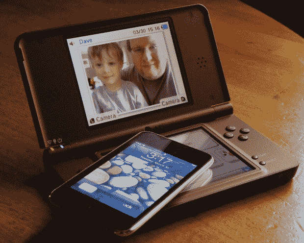
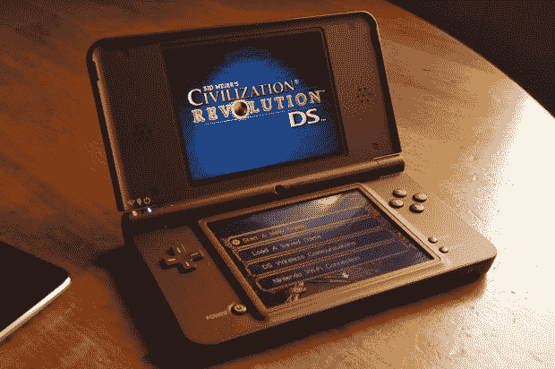
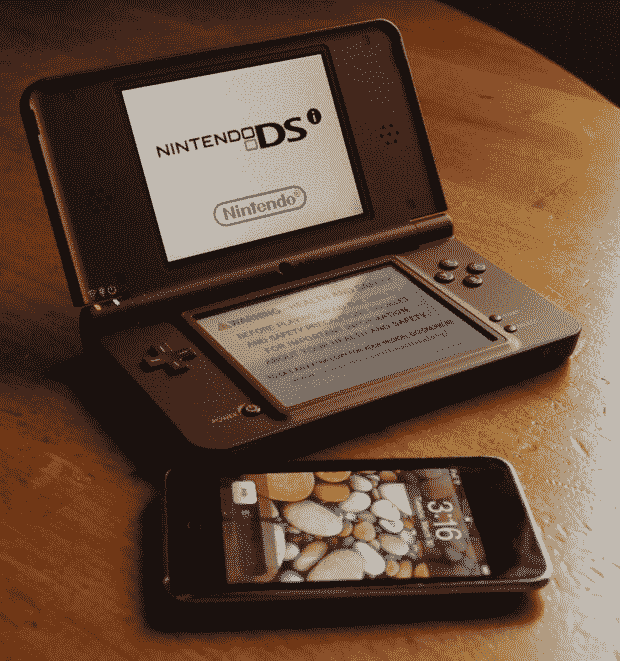

# 点评:任天堂 DSi XL | TechCrunch

> 原文：<https://web.archive.org/web/https://techcrunch.com/2010/03/30/review-nintendo-dsi-xl/>

 **短版:**任天堂新出的 [DSi XL](https://web.archive.org/web/20230305033537/http://www.crunchgear.com/tag/dsi-xl/) 直接瞄准了[老一辈休闲游戏玩家](https://web.archive.org/web/20230305033537/http://www.crunchgear.com/2010/03/03/the-dsi-xl-shows-once-and-for-all-that-gaming-is-no-longer-just-for-gamers/)。那些喜欢更容易阅读的东西的人。那些戴着老花镜的人，他们坐下来喝一杯纤维早餐，阅读他们的 AARP 杂志。上帝保佑，我喜欢。

**功能:**

*   更大的屏幕
*   全尺寸手写笔
*   预装了*大脑年龄快车:数学*和*大脑年龄快车:艺术&字母*
*   建议零售价:189.99 美元(普通每日生活津贴为 169.99 美元)

 **优点:**

*   大屏幕容易阅读
*   游戏看起来仍然很棒
*   外壳尺寸更易于握持

缺点:

*   大尺寸降低了便携性
*   无处放置手写笔
*   手小的人不舒服

我喜欢任天堂的便携式游戏机。我有一个游戏机，游戏机颜色，DS phat，和一个 DS Lite，但我从来没有看到在 DSi 的点。所以当任天堂发给我一台 DSi XL 进行评测时，我对它的功能感到惊喜。我会购买 DSi XL 来替换我的 DS Lite 吗？可能不会——但我确实喜欢 DSi XL，并向希望进入便携式游戏的人推荐它。

构建质量正如您所期望的那样。任天堂知道这些东西会被打破，所以他们制造它们，以便他们可以接受。我收到的设备是古铜色的，大部分设备都是哑光的。然而，封面的顶部是光滑的，可以看到指纹。不像你在 PSP 上看到的指纹，但它们确实存在。

我不会在这里重新发明轮子，直到[回顾 DSi 功能](https://web.archive.org/web/20230305033537/http://www.crunchgear.com/2009/04/04/review-nintendo-dsi/)。是的，是 DSi，只是更大。它是为玩 Radio Shack 的 10 美元 21 点小游戏的老年人群设计的，如果他们适当地营销它，它将是巨大的。我有一双大手。我喜欢 DSi XL，因为我喜欢更大的外形和更大的屏幕。我妻子不太喜欢。她的手变小了，在玩了大约 30 分钟*塞尔达:幻影沙漏*后，她发现 DSi XL 让她的左手开始抽筋。我看到另一篇评论提到了屏幕清晰度的问题。我肯定没注意到这个问题。我喜欢玩像文明革命这样的即时战略游戏，如果屏幕模糊，我肯定会注意到。屏幕清晰明了，感觉游戏根本不是为更小的显示器设计的，这是我第一次读到 DSi XL 时担心的事情之一。

该不该买 DSi XL？当然，如果你还没有 DSi 的话。我只是建议你先去当地的游戏店买一个，以确保大小不成问题。它是 DS 或 DS Lite 的合理升级吗？绝对的。母亲节你应该给你妈妈买一个吗？除非你是个超级极客，而且你确定她会喜欢。

[产品页面:任天堂 DSi XL](https://web.archive.org/web/20230305033537/http://www.nintendodsi.com/meet-dsi-xl.jsp)