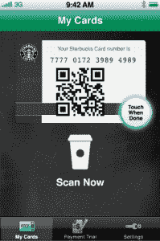

# 星巴克现在允许你在 1000 多家目标店通过 iPhone 支付咖啡费用 TechCrunch

> 原文：<https://web.archive.org/web/http://techcrunch.com/2010/03/30/starbucks-now-letting-you-pay-for-your-coffee-fix-via-iphone-in-1000-target-stores/>

# 星巴克现在允许你在 1000 多家目标店通过 iPhone 支付咖啡费用

回到去年 9 月，星巴克通过他们的[星巴克卡手机](https://web.archive.org/web/20230205000847/http://www.mobilecrunch.com/2009/09/23/can-i-get-two-grande-non-fat-no-whip-starbucks-apps/) iPhone 应用程序，让你有可能支付你每天摄入的咖啡因。整个概念非常简单:输入你的星巴克卡信息，验证一些细节，然后砰！iPhone 应用程序*变成了*礼品卡，在结账的时候会显示一个安全的二维码，供咖啡师扫描。

问题是:在星巴克大约 740 亿个门店中，只有少数开始接受移动支付系统。因为很少。十六岁的时候。直到今天！

星巴克刚刚宣布，他们现在在全国 1000 多家目标商店接受 iPhone 应用程序支付，一夜之间测试地点的数量增加了 6000%以上。现在，去吧，去付你那杯布朗酒的钱，再也不用担心钱包和现金这些无聊的事情了。(务必先检查[商店定位器](https://web.archive.org/web/20230205000847/http://www.starbucks.com/store-locator)，以确保您当地的目标点参与了推广。)