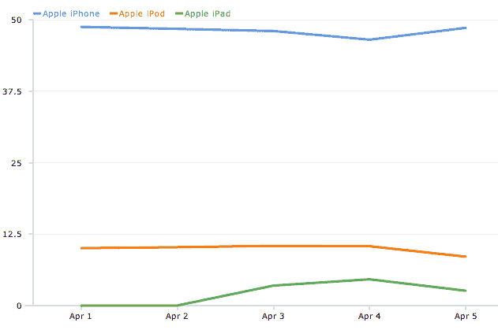

# 早期的网页浏览数据显示，iPad 是周末用的，iPhone 是工作用的 TechCrunch

> 原文：<https://web.archive.org/web/https://techcrunch.com/2010/04/05/ipad-weekend-iphone-work/?utm_source=feedburner&utm_medium=feed&utm_campaign=Feed%3A+Techcrunch+%28TechCrunch%29>

# 早期的网页浏览数据显示，iPad 是周末用的，iPhone 是工作用的

iPad 配备了一个大而漂亮的浏览器，这可能会成为它最强大的应用程序(当无线网络工作时)。来自网络分析服务 Clicky 的一些[早期数据](https://web.archive.org/web/20221206163600/http://getclicky.com/marketshare/global/ipad/)显示，截至周日，iPad 占所有移动浏览的 4.62%，相比之下，iPhone 下降了近 2 个百分点，至 46.5%。

今天，iPhone 的移动网络浏览份额回升至 48.6%，而 iPad 的份额下降至 2.6%。这两点差异很可能是因为人们把 iPads 留在家里，在开始一周的工作时又回到了 iPhones 上。

如果我们继续看到这种模式，iPad 的使用在周末达到高峰，那么这意味着人们不是真的把它带在身边，而是把它留在家里。一旦 3G 版出来，这种模式将可能改变。

Clicky 在每月有 1 亿人访问的 20 万个网站上运行网络分析，这就是这些数字的来源。