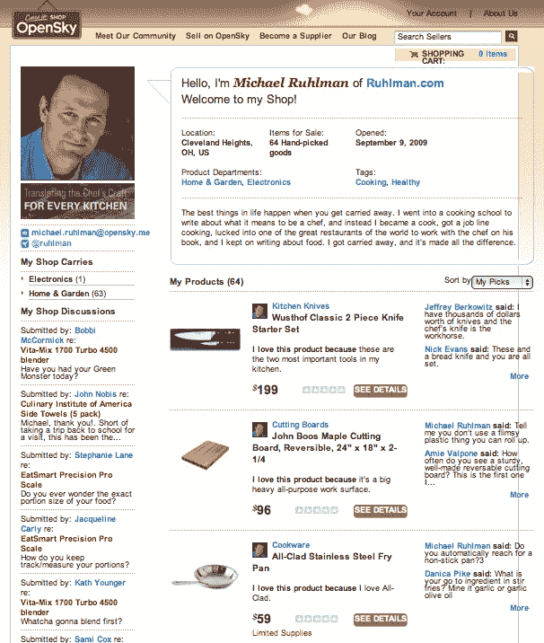

# 发布:OpenSky 希望在不牺牲博客作者灵魂的情况下将他们变成卖家

> 原文：<https://web.archive.org/web/https://techcrunch.com/2010/04/06/opensky-bloggers-sellers/>

任何优秀的博客作者或“有影响力的人”都是天生的推销员，但他或她卖的(通常)是想法或生活方式，而不是实际的商品。OpenSky 的首席执行官约翰·卡普兰认为他可以把拥有忠实观众的有影响力的人变成卖家，而不一定会出卖他们。“为什么我们不从我们喜欢和尊敬的人那里购买商品？”他问道，哀叹我们与网上商家之间冷漠的关系。

但是有很多博客和作家，他们所做的几乎都是推荐产品和服务。美食博主、美妆博主、时尚博主、设计博主、健康博主、运动博主，应有尽有。几乎任何曾经可以在女性或男性杂志上找到的建议现在都可以在网上找到，而且其中许多都有少量但忠实的读者。他们从自己的影响力中赚钱的唯一方式是通过广告或附属网络或秘密的按帖付费。

卡普兰曾是 About.com 的总裁，后来担任福特汽车公司的首席执行官，他认为自己找到了更好的方法。2009 年 5 月，他从高地资本、迦南合伙公司和罗恩·康韦获得了 500 万美元的首轮融资。OpenSky 帮助像 KathEats 的 [Kath Younger](https://web.archive.org/web/20230404231748/http://katheats.theopenskyproject.com/) 、厨师 [Michael Ruhlman](https://web.archive.org/web/20230404231748/http://blog.ruhlman.com/shop) 和 [Truth In Aging](https://web.archive.org/web/20230404231748/http://truthinaging.com/) 的 Marta Wohrle 这样的博主建立[商店](https://web.archive.org/web/20230404231748/http://katheats.theopenskyproject.com/)，销售他们推荐的[产品](https://web.archive.org/web/20230404231748/http://ruhlman.theopenskyproject.com/?___store=en_ruhlman#0)，并从每笔销售中获得分成。“电子商务收入正在赶上广告收入，今年有望超过它，”评论化妆品和“抗衰老”产品的沃尔勒报告说。

虽然 OpenSky 乍听起来像一个联盟网络，但它不是。他们没有把顾客送到其他在线商店，而是把他们送到自己的商店，在那里他们可以跟踪销售情况，并跟踪个性化信息。OpenSky hand 挑选获准在其网络中开店和销售的出版商。然后，它直接与制造商和经销商达成交易，这些制造商和经销商同意将任何售出的商品直接发送给通过 OpenSky 商店点击购买的读者。博客作者没有获得 3%到 10%的会员费，而是与 OpenSky 平分净利润。显然，高利润产品的经济效果最好。

目前有 250 家出版商和 500 家制造商处于 OpenSky 的私有测试版中。出版商只有在有人真正购买产品时才能获得报酬，如果在一年内退货，他们的账户上就会出现借方。这个系统的建立是为了奖励销售你真正关心和了解的东西。“我们卖我喜欢的东西，但通常很难买到，”沃尔勒说。“我的简讯订阅者可以享受折扣，我们非常努力地与制造商合作，为我们独家获得优惠。”(你可以在这里查看[她的店铺)。](https://web.archive.org/web/20230404231748/http://truthinaging.theopenskyproject.com/)

但这不就是叫卖主义的另一个名字吗？随着 OpenSky 向越来越多的卖家博客开放，不可避免的会有很多这样的东西。OpenSky 也与 Twitter 和脸书合作，在这些地方，它变得更加难以推销。但是 OpenSky 所追求的是一切都是公开的。不存在品牌或制造商为一篇文章付费或给有影响力的博主免费产品的问题。博客作者自己销售产品，读者可以自己判断他们是叫卖者还是正版。叫卖者将失去他们的观众(和他们的灵魂)。正宗的会增加他们的观众，告诉他们买什么。

或者至少这是约翰·卡普兰正在兜售的故事。

