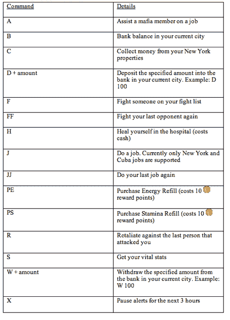

# Zynga 黑手党战争上瘾者现在可以用短信痛击他们的对手

> 原文：<https://web.archive.org/web/https://techcrunch.com/2010/04/06/zynga-mafia-wars-addicts-can-now-whack-their-rivals-with-an-sms-message/>

# Zynga 黑手党战争上瘾者现在可以用短信打击他们的对手

黑手党战争迷现在可以在任何有手机信号的地方找到他们的毒品。社交游戏巨头 [Zynga](https://web.archive.org/web/20221006134147/http://www.zynga.com/) 刚刚开始为广受欢迎的以黑帮为主题的脸书游戏推出双向短信支持，允许用户从几乎任何手机上接收通知和玩游戏。新功能目前正在有限的基础上推出，但感兴趣的用户可以通过点击游戏的帮助按钮并从菜单中选择“手机短信”来注册[这里](https://web.archive.org/web/20221006134147/http://apps.facebook.com/inthemafia/)。

Zynga 在 12 月份首次开始测试短信功能，但最初的测试只支持单向通知——你可以接收游戏提醒，但如果你想在游戏中做点什么，你必须使用电脑。现在，您将能够在旅途中使用一组相当简单的命令来玩游戏。你可以在下面看到一个命令列表，玩家可以发送短信给 Zynga 的 fitting shortcode: MAFIA (62342)。**更新:**我们还应该指出，这是由 [4INFO](https://web.archive.org/web/20221006134147/http://www.4info.com/) 提供支持的，它提供了一个短信发布平台和一个广告网络(参见我们对首席执行官 [Zaw Thet](https://web.archive.org/web/20221006134147/http://www.crunchbase.com/person/zaw-thet) 的采访[)。](https://web.archive.org/web/20221006134147/https://beta.techcrunch.com/2010/02/10/a-look-at-4info-the-king-of-sms/)

Zynga 的短信功能非常重要，因为它为该公司提供了另一种不受脸书直接控制的联系用户的方式。Zynga 严重依赖使用脸书通知来保持用户参与，但这家社交网络最近决定停止允许第三应用程序通过这一渠道发送消息。

Zynga 表示，目前的测试仅限于黑手党战争，但我们可以期待他们在未来将它推广到其他游戏。也就是说，黑手党战争是基于文本的，可以很好地转换成短信命令 Zynga 的一些更丰富的游戏可能不适合短信游戏。

